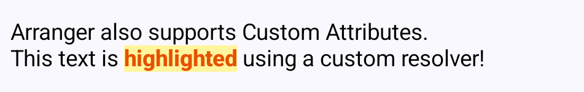

# Arranger - Type-safe Rich Text for Jetpack Compose

> [!WARNING]
> **Work In Progress**: This library is currently under active development. APIs are unstable and subject to change without notice.

## Project Vision & Features
The goal of "Arranger" is to provide a "declarative, type-safe, and immutable string manipulation experience similar to SwiftUI's `AttributedString`" to Jetpack Compose and Kotlin Multiplatform (KMP). We aim to break away from the tedious, error-prone index manipulations required by the existing `AnnotatedString` and the traditional WYSIWYG approaches.

* **Type-Safe Custom Attributes:** Define and apply UI-specific styles (like `SpanStyle`) and domain-specific attributes (e.g., `@Mention`, `#Hashtag`) with full compile-time safety.
* **Run-Based Manipulation:** Treat text not just as an array of characters, but as "Runs" (chunks of text with identical attributes). This allows for semantic iteration, searching, and editing.
* **Declarative Formatting Constraints:** Provide a way to declaratively define constraints (e.g., "This text field only allows bold text and links") to automatically strip unwanted styles during paste or input.
* **Native Compose Integration (1.7+):** Elegantly separate state management and UI rendering by leveraging the latest `TextFieldState` and `OutputTransformation`.

## Why Arranger? (Inspiration from SwiftUI)
Compared to Android's traditional `SpannableStringBuilder` or Compose's `AnnotatedString`, Arranger offers a superior, modern API design:
* **Semantic "Runs":** Instead of managing `startIndex` and `endIndex`, developers can iterate over `Runs` (e.g., "find all chunks of mentions").
* **Value Semantics:** The core text data structures are immutable, ensuring thread safety and predictable UI re-rendering, which is highly compatible with Compose.
* **Type Safety:** We use Kotlin's Extension Functions with receivers to create an intuitive, declarative DSL for composing attributes.

## Basic Usage (Getting Started)

Arranger's biggest selling point is that you can programmatically construct and decorate RichText using a clean DSL. Simply create a `RichTextState`, decorate it with `editAttributes`, and pass it to the `RichTextEditor`.

```kotlin
@Composable
fun BasicUsageSample(modifier: Modifier = Modifier) {
    val initialText = "Welcome to Arranger!\nEnjoy building RichText in Compose programmatically."

    // 1. Initialize state with minimal attributes using the declarative DSL
    val state = remember {
        RichTextState(
            initialText = RichString(text = initialText).edit {
                editAttributes(range = initialText.rangeOf("Arranger!")) {
                    bold()
                    textColor(Color(0xFF6200EA)) // Purple
                }
            }
        )
    }

    // 2. Render natively via Compose 1.7
    RichTextEditor(
        state = state,
        modifier = Modifier.fillMaxWidth(),
    )
}
```

## Paragraph Styles & Advanced Formatting

Arranger natively supports not only inline character formatting (like colors and boldness) but also block-level paragraph formatting such as Headers, Blockquotes, and Alignments.

```kotlin
@Composable
fun AdvancedFormattingSample(modifier: Modifier = Modifier) {
    val initialText =
        "Advanced Formatting Options\n" +
            "You can easily apply various text and paragraph styles.\n\n" +
            "Paragraph Styling\n" +
            "This paragraph is explicitly centered, overriding the default alignment.\n" +
            "> Blockquotes are perfect for highlighting external quotes or important notes."

    val state =
        remember {
            RichTextState(
                initialText =
                    RichString(text = initialText).edit {
                        editAttributes(range = initialText.rangeOf("Advanced Formatting Options")) {
                            headingLevel(HeadingLevel.H1)
                        }
                        editAttributes(range = initialText.rangeOf("Paragraph Styling")) {
                            headingLevel(HeadingLevel.H3)
                        }
                        editAttributes(range = initialText.rangeOf("This paragraph is explicitly centered, overriding the default alignment.")) {
                            textAlignment(TextAlignment.Center)
                        }
                        editAttributes(range = initialText.rangeOf("> Blockquotes are perfect for highlighting external quotes or important notes.")) {
                            blockquote()
                        }
                        editAttributes(range = initialText.rangeOf("various text and paragraph styles")) {
                            textColor(Color(0xFFE91E63)) // Pink
                            bold()
                            underline()
                        }
                    },
            )
        }

    RichTextEditor(
        state = state,
        modifier = Modifier.fillMaxWidth(),
    )
}
```

## Custom Attribute Mapping

You can define custom attribute keys and map them to Compose styles. Below shows an example of implementing a simple highlight feature by creating a custom `SpanAttributeKey` and styling it with an `AttributeStyleResolver`.

```kotlin
// 1. Define Custom Attribute Key
object HighlightKey : SpanAttributeKey<Unit> {
    override val name: String = "Highlight"
    override val defaultValue: Unit = Unit
}

@Composable
fun CustomAttributeSample(modifier: Modifier = Modifier) {
    val initialText = "Arranger also supports Custom Attributes.\nThis text is highlighted using a custom resolver!"

    // 2. Initialize RichTextState with the custom attribute
    val state = remember {
        RichTextState(
            initialText = RichString(text = initialText).edit {
                val range = initialText.rangeOf("highlighted")
                setSpanAttribute(HighlightKey, Unit, range)
            }
        )
    }

    // 3. Create a custom AttributeStyleResolver inheriting from DefaultAttributeStyleResolver
    val customResolver = remember {
        AttributeStyleResolver(base = DefaultAttributeStyleResolver) {
            spanStyle(HighlightKey) {
                SpanStyle(
                    background = Color(0xFFFFF59D), // Light Yellow
                    color = Color(0xFFE65100),      // Orange Text
                    fontWeight = FontWeight.ExtraBold
                )
            }
        }
    }

    // 4. Pass the custom resolver to RichTextEditor
    RichTextEditor(
        state = state,
        styleResolver = customResolver,
        modifier = modifier.fillMaxWidth(),
    )
}
```



## Batch Editing (Searching & Querying)

Arranger treats text as semantic "Runs" (chunks of text with identical attributes). This allows you to effortlessly search for patterns or query existing attributes, and modify them all at once.

### Searching and Highlighting
You can easily search for strings or regular expressions and apply styles to all occurrences at once using `rangesOf` and `editAll`. Here's a sample that highlights hashtags in real-time.

```kotlin
@Composable
fun HashtagHighlightSample(modifier: Modifier = Modifier) {
    val initialText = "Type some #hashtags here!\nFor example: #Compose is #awesome"

    val state = remember {
        RichTextState(
            initialText = RichString(text = initialText)
        )
    }

    LaunchedEffect(state) {
        snapshotFlow { state.richString.text }.collect { text ->
            state.edit {
                // Clear existing colors first
                editAttributes(range = text.indices) {
                    clearTextColor()
                }
                
                // Find all hashtags and highlight them in blue
                val hashtagRanges = text.rangesOf(Regex("#\\w+"))
                editAll(hashtagRanges) {
                    textColor(Color(0xFF1976D2)) // Blue
                }
            }
        }
    }

    Column(modifier = Modifier.padding(16.dp)) {
        Text("Searching and Highlighting", fontWeight = FontWeight.Bold)
        Spacer(modifier = Modifier.height(16.dp))

        RichTextEditor(
            state = state,
            modifier = Modifier.fillMaxWidth(),
        )
    }
}
```

### Querying and Modifying Attributes
Instead of text searching, you can also query existing attributes using `runs(key)` and apply a batch edit over those specific runs. This is useful for semantic manipulations like changing the color of all bold texts.

> [!NOTE]
> For more complex queries, you can also use `runs { predicate }` to extract runs that match any custom condition based on their attributes.

```kotlin
@Composable
fun AttributeBatchEditSample(modifier: Modifier = Modifier) {
    val initialText = "This text has some bold words.\n" +
            "We can find all bold parts and change their color at once."

    val state = remember {
        RichTextState(
            initialText = RichString(text = initialText).edit {
                editAttributes(range = initialText.rangeOf("bold words")) {
                    bold()
                }
                editAttributes(range = initialText.rangeOf("bold parts")) {
                    bold()
                }
            }
        )
    }

    Column(modifier = Modifier.padding(16.dp)) {
        Text("Querying and Modifying Attributes", fontWeight = FontWeight.Bold)
        Spacer(modifier = Modifier.height(16.dp))

        Button(
            onClick = {
                // Find all runs that have the BoldKey
                val boldRuns = state.richString.runs(BoldKey)
                
                // Batch edit those specific runs
                state.edit {
                    editAll(boldRuns) {
                        textColor(Color(0xFFD32F2F)) // Red
                    }
                }
            },
            modifier = Modifier.fillMaxWidth()
        ) {
            Text("Highlight Bold Text in Red")
        }
        
        Spacer(modifier = Modifier.height(16.dp))

        RichTextEditor(
            state = state,
            modifier = Modifier.fillMaxWidth(),
        )
    }
}
```

## Core Architecture Overview
To ensure scalability up to PC-class text sizes and pure Kotlin compatibility (KMP), the architecture is layered:

### Pure Kotlin Core (Data Structures)
* **`RichStringBuffer`**: A buffer class used to safely mutate the attributes of a string within an `edit` block. Designed to accumulate mutations and produce a completely new, immutable `RichString`.
* **`AttributeKey<T>`**: Defines the data type of an attribute.
* **`RichString` & `RichRun`**: Immutable representations of text and its semantic chunks.
* **`AttributeContainer`**: A core structure holding a type-safe map of attributes, which is associated with specific text ranges to form `RichSpan`s.

### Compose UI Layer
* **`RichTextState`**: Wraps `TextFieldState` and manages the Spans. It acts as the single source of truth and exposes the complete `RichString`.
* **`RichTextOutputTransformation`**: Converts the plain text and spans into Compose's `AnnotatedString` purely at render time.
* **`RichTextEditor`**: A simple, declarative Composable wrapping `BasicTextField` with our state and transformation.

## Development Roadmap

- [x] **1. Core Data Structures (The Core)**
    * Implementation of a range-based data structure (e.g., Interval Tree) to manage attributes by range rather than character indices.
    * Foundation setup for `AttributeKey` and extension properties.
- [x] **2. Runs API Implementation**
    * Logic to segment strings into semantic chunks (`RichRun`) that can be operated on as an iterator.
- [x] **3. Integration with TextFieldState / OutputTransformation**
    * Logic to hook into `TextFieldBuffer` modifications (insertions/deletions) and dynamically track/shift the indices of the underlying attribute tree.
- [x] **4. Implementation of Basic Built-in AttributeKeys**
    * Basic character-level decorations (e.g., Bold, Text Color, Underline, Italics, Font Size).
    * Paragraph-level decorations (e.g., Headings, Bullet Lists).
- [x] **5. Custom Attribute Mapping APIs**
    * Expose mechanisms allowing developers to customize how default `AttributeKey`s are translated into Compose `AnnotatedString` styles.
- [ ] **6. Declarative Formatting Constraints**
    * Mechanism leveraging `InputTransformation` to parse pasted clipboard HTML/RichText and strictly filter allowed attributes based on an access list.
- [ ] **7. Full Attribute Restoration on Undo/Redo**
    * Seamlessly align with `TextFieldState`'s native Undo/Redo to accurately restore historical attribute ranges.
- [ ] **8. Performance Tuning**
    * Optimize internal data structures to production-grade performance variants (e.g., Rope or Piece Table) for large text handling.
- [ ] **9. Kotlin Multiplatform (KMP) Support**
    * Ensure the core data structures, state management, and formatting logic are fully platform-agnostic to support Compose Multiplatform distribution (iOS, Desktop, Web).