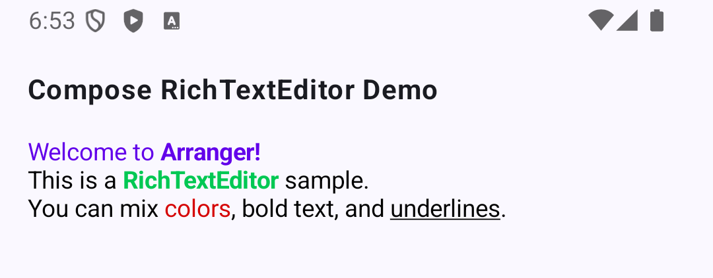

# Arranger - Type-safe Rich Text for Jetpack Compose

> [!WARNING]
> **Work In Progress**: This library is currently under active development. APIs are unstable and subject to change without notice.

## Project Vision
The goal of "Arranger" is to provide a "declarative, type-safe, and immutable string manipulation experience similar to SwiftUI's `AttributedString`" to Jetpack Compose and Kotlin Multiplatform (KMP). We aim to break away from the tedious, error-prone index manipulations required by the existing `AnnotatedString` and the traditional WYSIWYG approaches.

## Target Developer Experience (DX)
* **Type-Safe Custom Attributes:** Define and apply UI-specific styles (like `SpanStyle`) and domain-specific attributes (e.g., `@Mention`, `#Hashtag`) with full compile-time safety.
* **Run-Based Manipulation:** Treat text not just as an array of characters, but as "Runs" (chunks of text with identical attributes). This allows for semantic iteration, searching, and editing.
* **Declarative Formatting Constraints:** Provide a way to declaratively define constraints (e.g., "This text field only allows bold text and links") to automatically strip unwanted styles during paste or input.
* **Native Compose Integration (1.7+):** Elegantly separate state management and UI rendering by leveraging the latest `TextFieldState` and `OutputTransformation`.

## Why SwiftUI's Paradigm? (Inspiration)
Compared to Android's traditional `SpannableStringBuilder` or Compose's `AnnotatedString`, SwiftUI offers superior API design:
* **Type Safety:** We will simulate SwiftUI's `@dynamicMemberLookup` using Kotlin's Extension Properties to allow intuitive, property-like access to attributes.
* **Semantic "Runs":** Instead of managing `startIndex` and `endIndex`, developers can iterate over `Runs` (e.g., "find all chunks of mentions").
* **Value Semantics:** The core text data structures will be immutable, ensuring thread safety and predictable UI re-rendering, which is highly compatible with Compose.
* **Paste Protection:** Prevent "paste pollution" (unintended massive fonts or weird colors) via declarative constraints without writing messy parsers.

## Core Architecture Overview
To ensure scalability up to PC-class text sizes and pure Kotlin compatibility (KMP), the architecture is layered:

### Pure Kotlin Core (Data Structures)
* **`RichTextBuffer`**: An abstraction interface for the underlying string storage. The MVP will use a simple implementation, but it is designed to be replaceable with advanced structures (like Rope or Piece Table) for handling massive documents in the future.
* **`AttributeKey<T>`**: Defines the data type of an attribute.
* **`RichString` & `RichRun`**: Immutable representations of text and its semantic chunks.
* **`AttributeRangedTree`**: An internal data structure (like an Interval Tree) to manage attributes by range, independent of string indices.

### Compose UI Layer
* **`RichTextState`**: Wraps `TextFieldState` and holds the `AttributeRangedTree`. It acts as the single source of truth.
* **`RichTextOutputTransformation`**: Converts the plain text and internal attribute tree into Compose's `AnnotatedString` purely at render time.
* **`RichTextEditor`**: A simple, declarative Composable wrapping `BasicTextField` with our state and transformation.

## Quick Start (Current Usage)

```kotlin
@Composable
fun RichTextSampleScreen(modifier: Modifier = Modifier) {
    val initialText =
        "Arranger RichText Editor\n" +
            "Welcome to Arranger! This is a sample.\n" +
            "You can mix colors, bold text, and underlines.\n\n" +
            "Paragraph Styles Demo\n" +
            "This paragraph is centered correctly.\n" +
            "> This is a blockquote with nice indents."

    // 1. Initialize RichTextState with standard attributes via declarative DSL
    val state = remember {
        RichTextState(
            initialText =
                RichString(text = initialText).edit {
                    editAttributes(range = initialText.rangeOf("Arranger RichText Editor")) {
                        headingLevel(HeadingLevel.H1)
                    }
                    editAttributes(range = initialText.rangeOf("Paragraph Styles Demo")) {
                        headingLevel(HeadingLevel.H3)
                    }
                    editAttributes(range = initialText.rangeOf("This paragraph is centered correctly.")) {
                        textAlignment(TextAlignment.Center)
                    }
                    editAttributes(range = initialText.rangeOf("> This is a blockquote with nice indents.")) {
                        blockquote()
                    }
                    editAttributes(range = initialText.rangeOf("Arranger!")) {
                        bold()
                    }
                    editAttributes(range = initialText.rangeOf("Welcome to Arranger!")) {
                        textColor(Color(0xFF6200EA))
                    }
                    editAttributes(range = initialText.rangeOf("colors")) {
                        textColor(Color(0xFFD50000))
                    }
                    editAttributes(range = initialText.rangeOf("bold text")) {
                        bold()
                    }
                    editAttributes(range = initialText.rangeOf("underlines")) {
                        underline()
                    }
                }
        )
    }

    // 2. Render natively via Compose 1.7
    // RichTextEditor automatically uses \`DefaultAttributeStyleResolver\` for standard styling attributes.
    RichTextEditor(
        state = state,
        modifier = modifier.fillMaxWidth(),
    )
}
```



## Custom Attribute Mapping

You can define custom attribute keys and map them to Compose styles. Below shows an example of implementing a simple highlight feature by creating a custom `SpanAttributeKey` and styling it with an `AttributeStyleResolver`.

```kotlin
// 1. Define Custom Attribute Key
object HighlightKey : SpanAttributeKey<Unit> {
    override val name: String = "Highlight"
    override val defaultValue: Unit = Unit
}

@Composable
fun CustomAttributeSampleItem(modifier: Modifier = Modifier) {
    val initialText = "Arranger also supports Custom Attributes.\nThis text is highlighted using a custom resolver!"

    // 2. Initialize RichTextState with the custom attribute
    val state = remember {
        RichTextState(
            initialText = RichString(text = initialText).edit {
                val range = initialText.rangeOf("highlighted")
                setSpanAttribute(HighlightKey, Unit, range)
            }
        )
    }

    // 3. Create a custom AttributeStyleResolver inheriting from DefaultAttributeStyleResolver
    val customResolver = remember {
        AttributeStyleResolver(base = DefaultAttributeStyleResolver) {
            spanStyle(HighlightKey) {
                SpanStyle(
                    background = Color(0xFFFFF59D), // Light Yellow
                    color = Color(0xFFE65100),      // Orange Text
                    fontWeight = FontWeight.ExtraBold
                )
            }
        }
    }

    // 4. Pass the custom resolver to RichTextEditor
    RichTextEditor(
        state = state,
        styleResolver = customResolver,
        modifier = modifier.fillMaxWidth(),
    )
}
```

## Development Roadmap

- [x] **1. Core Data Structures (The Core)**
    * Implementation of a range-based data structure (e.g., Interval Tree) to manage attributes by range rather than character indices.
    * Foundation setup for `AttributeKey` and extension properties.
- [x] **2. Runs API Implementation**
    * Logic to segment strings into semantic chunks (`RichRun`) that can be operated on as an iterator.
- [x] **3. Integration with TextFieldState / OutputTransformation**
    * Logic to hook into `TextFieldBuffer` modifications (insertions/deletions) and dynamically track/shift the indices of the underlying attribute tree.
- [x] **4. Implementation of Basic Built-in AttributeKeys**
    * Basic character-level decorations (e.g., Bold, Text Color, Underline, Italics, Font Size).
    * Paragraph-level decorations (e.g., Headings, Bullet Lists).
- [x] **5. Custom Attribute Mapping APIs**
    * Expose mechanisms allowing developers to customize how default `AttributeKey`s are translated into Compose `AnnotatedString` styles.
- [ ] **6. Declarative Formatting Constraints**
    * Mechanism leveraging `InputTransformation` to parse pasted clipboard HTML/RichText and strictly filter allowed attributes based on an access list.
- [ ] **7. Full Attribute Restoration on Undo/Redo**
    * Seamlessly align with `TextFieldState`'s native Undo/Redo to accurately restore historical attribute ranges.
- [ ] **8. Performance Tuning**
    * Optimize internal data structures to production-grade performance variants (e.g., Rope or Piece Table) for large text handling.
- [ ] **9. Kotlin Multiplatform (KMP) Support**
    * Ensure the core data structures, state management, and formatting logic are fully platform-agnostic to support Compose Multiplatform distribution (iOS, Desktop, Web).