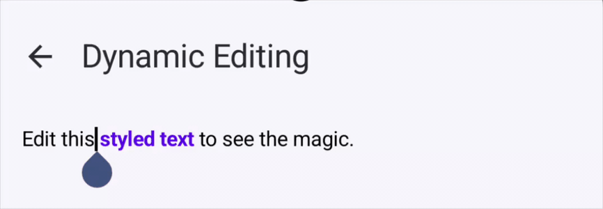
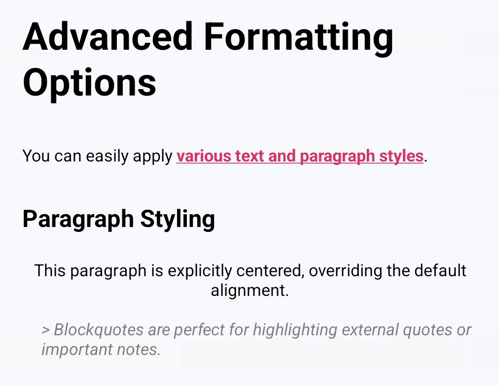
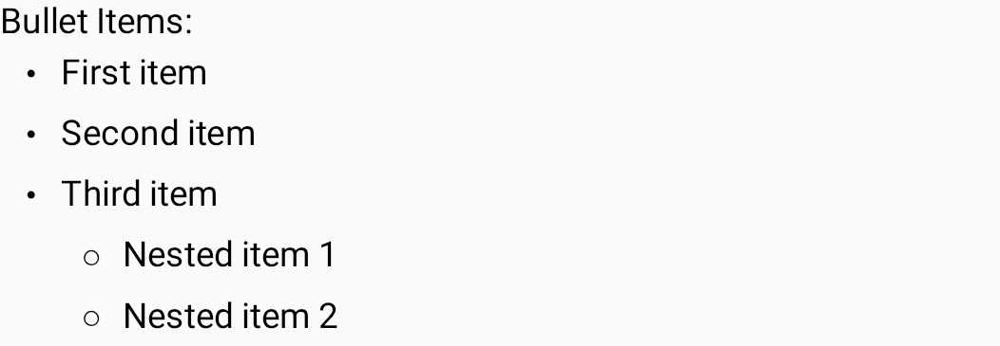
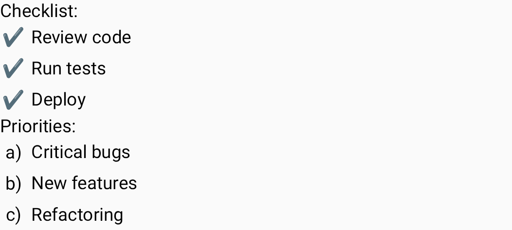
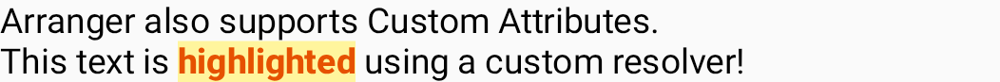
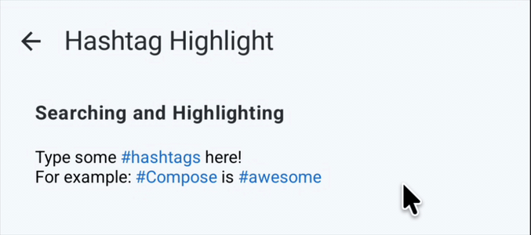
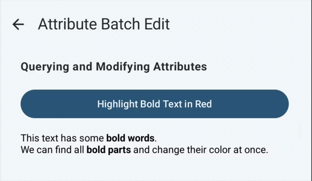
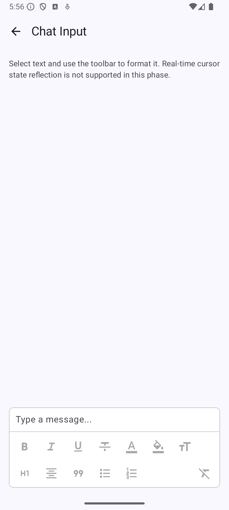

# Arranger - Type-safe Rich Text Editor Engine for Jetpack Compose

[](https://github.com/mkeeda/arranger/actions/workflows/ci.yml)
[](https://search.maven.org/search?q=g:%22dev.mkeeda.arranger%22%20AND%20a:%22arranger-richtext-editor%22)
[](https://opensource.org/licenses/Apache-2.0)

Arranger is a declarative, type-safe rich text editor engine and UI components for Jetpack Compose.
While standard `buildAnnotatedString` is perfect for static text decoration, it quickly breaks down when building real-time editors where users insert and delete text. Arranger is built specifically for **dynamic text operations**, automatically managing and shifting attribute spans (like bold, colors, or links) as the underlying text mutates.

<div align="center">
  
</div>

> [!WARNING]
> **Work In Progress**: This library is currently under active development. APIs are unstable and subject to change without notice. We highly welcome your feedback, feature requests, and bug reports via GitHub Issues!

## Requirements
* **Android API Level 26+**
* **Jetpack Compose 1.7+**
* **Kotlin 2.3.20+**

## Core Features

* 🛡️ **Type-Safe Custom Attributes:** Define and apply UI-specific styles (like `SpanStyle`) and domain-specific attributes (e.g., `@Mention`, `#Hashtag`) with full compile-time safety.
* 🔄 **Atomic Mutations:** Safely insert, delete, and replace text. Arranger automatically tracks and shifts span indices, eliminating manual calculation errors.
* 🔍 **Semantic "Runs":** Treat text not just as characters, but as "Runs" (chunks of text with identical attributes). This allows for semantic iteration, searching, and batch editing.
* 🎨 **Declarative Constraints (Planned):** Provide a way to declaratively define constraints (e.g., "This text field only allows bold text and links") to automatically strip unwanted styles.
* 🧩 **Native Compose Integration (1.7+):** Elegantly separate state management and UI rendering by leveraging the latest `TextFieldState` and `OutputTransformation`.

## Why Arranger?

Arranger solves the biggest pain points of traditional rich text handling in Android and Compose.

### 1. No More Manual Index Math (Dynamic Editor State)
While standard `buildAnnotatedString` is excellent for decorating static text, it is not designed for dynamic input. If a user inserts or deletes text in the middle of an `AnnotatedString`, all subsequent span indices become misaligned, and you are forced to manually recalculate them. This manual index math is tedious and highly error-prone when building a real-time text editor.

**The Pain (`AnnotatedString`)**
```kotlin
// The Pain: If a user inserts text, you must manually recalculate all span indices!
val oldText = "Hello Bold Text"
val oldSpans = listOf(AnnotatedString.Range(SpanStyle(fontWeight = FontWeight.Bold), 6, 10))

// Inserting "!" at the beginning
val newText = "!" + oldText
val newSpans = oldSpans.map { 
    // Manual index shifting - tedious and highly error-prone
    AnnotatedString.Range(it.item, it.start + 1, it.end + 1) 
}
```

**The Arranger Way**
Arranger automatically tracks and shifts spans during text mutations.
```kotlin
// Arranger Way 1: Automatically tracks and shifts spans during text mutations.
state.edit {
    insert(index = 0, text = "!")
    // The "Bold" span is automatically shifted. No manual index math required!
}
```

### 2. Semantic Attribute Search via "Runs"
Inspired by SwiftUI's `AttributedString.Runs`, Arranger treats text as semantic chunks. You can easily find and batch-edit specific attributes without complex regex or index tracking.

```kotlin
// Arranger Way 2: Semantic iteration over attributes via "Runs"
state.edit {
    // Find all chunks of text that are Bold, and turn them Red at once
    val boldRuns = state.richString.runs(BoldKey)
    editAll(boldRuns) {
        textColor(Color.Red)
    }
}
```

## Installation

Arranger is published to Maven Central. Add the following dependencies to your module's `build.gradle.kts`:

```kotlin
dependencies {
    // For Compose UI integration (RichTextEditor).
    // This automatically includes the core 'arranger-richtext' module.
    implementation("dev.mkeeda.arranger:arranger-richtext-editor:0.2.0-alpha02")

    // Or, if you only need the core data structures without Compose UI:
    // implementation("dev.mkeeda.arranger:arranger-richtext:0.2.0-alpha02")
}
```

## Dynamic Editing (Getting Started)

Arranger's true power lies in its ability to handle dynamic text input gracefully. When a user types in the `RichTextEditor`—or when you programmatically insert text into `RichTextState`—existing spans are automatically maintained and shifted. You don't need to write any custom logic to preserve formatting.

```kotlin
@Composable
fun DynamicEditingSample(modifier: Modifier = Modifier) {
    val initialText = "Edit this styled text to see the magic."

    // 1. Initialize state with formatting
    val state = remember {
        RichTextState(
            initialText = RichString(text = initialText).edit {
                editAttributes(range = initialText.rangeOf("styled text")) {
                    bold()
                    textColor(Color(0xFF6200EA)) // Purple
                }
            }
        )
    }

    // 2. Render natively via Compose 1.7
    // Try typing in the middle of "styled text"! 
    // Arranger automatically tracks and shifts the span indices in the background.
    RichTextEditor(
        state = state,
        modifier = Modifier.fillMaxWidth(),
    )
}
```


## Paragraph Styles & Advanced Formatting

Arranger natively supports not only inline character formatting (like colors and boldness) but also block-level paragraph formatting such as Headers, Blockquotes, and Alignments.

<details>
<summary><b>Show Code</b></summary>

```kotlin
@Composable
fun AdvancedFormattingSample(modifier: Modifier = Modifier) {
    val initialText =
        "Advanced Formatting Options\n" +
            "You can easily apply various text and paragraph styles.\n\n" +
            "Paragraph Styling\n" +
            "This paragraph is explicitly centered, overriding the default alignment.\n" +
            "> Blockquotes are perfect for highlighting external quotes or important notes."

    val state =
        remember {
            RichTextState(
                initialText =
                    RichString(text = initialText).edit {
                        editAttributes(range = initialText.rangeOf("Advanced Formatting Options")) {
                            headingLevel(HeadingLevel.H1)
                        }
                        editAttributes(range = initialText.rangeOf("Paragraph Styling")) {
                            headingLevel(HeadingLevel.H3)
                        }
                        editAttributes(range = initialText.rangeOf("This paragraph is explicitly centered, overriding the default alignment.")) {
                            textAlignment(TextAlignment.Center)
                        }
                        editAttributes(range = initialText.rangeOf("> Blockquotes are perfect for highlighting external quotes or important notes.")) {
                            blockquote()
                        }
                        editAttributes(range = initialText.rangeOf("various text and paragraph styles")) {
                            textColor(Color(0xFFE91E63)) // Pink
                            bold()
                            underline()
                        }
                    },
            )
        }

    RichTextEditor(
        state = state,
        modifier = Modifier.fillMaxWidth(),
    )
}
```

</details>



## Lists & Ordered Lists

Arranger provides native support for `bulletList` and `orderedList` paragraph formatting. You can apply list attributes over a text range, and the editor will automatically render the appropriate markers and handle indentation.

### Bullet Lists
Bullet lists automatically change their marker symbol based on the indentation level (e.g., Level 1 uses `・`, Level 2 uses `○`).

<details>
<summary><b>Show Code</b></summary>

```kotlin
@Composable
fun BulletListSample(modifier: Modifier = Modifier) {
    val initialText = "Bullet Items:\n" +
            "First item\n" +
            "Second item\n" +
            "Third item\n" +
            "Nested item 1\n" +
            "Nested item 2"

    val state = remember {
        RichTextState(
            initialText = RichString(text = initialText).edit {
                val itemsStart = initialText.indexOf("First item")
                val itemsEnd = initialText.indexOf("Nested item 1") - 1
                editAttributes(itemsStart until itemsEnd) {
                    bulletList(ListIndentLevel.Level1)
                }

                val nestedStart = initialText.indexOf("Nested item 1")
                val nestedEnd = initialText.length
                editAttributes(nestedStart until nestedEnd) {
                    bulletList(ListIndentLevel.Level2)
                }
            }
        )
    }

    RichTextEditor(
        state = state,
        modifier = modifier.fillMaxWidth(),
    )
}
```

</details>



### Ordered Lists
Ordered lists automatically calculate and display the sequence numbers based on their position and nesting level.

<details>
<summary><b>Show Code</b></summary>

```kotlin
@Composable
fun OrderedListSample(modifier: Modifier = Modifier) {
    val initialText = "Steps to follow:\n" +
            "Prepare ingredients\n" +
            "Cook the meal\n" +
            "Serve on plates"

    val state = remember {
        RichTextState(
            initialText = RichString(text = initialText).edit {
                val start = initialText.indexOf("Prepare ingredients")
                val end = initialText.length
                editAttributes(start until end) {
                    orderedList(ListIndentLevel.Level1)
                }
            }
        )
    }

    RichTextEditor(
        state = state,
        modifier = modifier.fillMaxWidth(),
    )
}
```

</details>


### Custom List Markers
You can customize the list markers by providing a `ListMarkerResolver` to the `RichTextEditor`. This allows you to use different symbols, letters, or parentheses for your lists.

<details>
<summary><b>Show Code</b></summary>

```kotlin
private val customMarkerResolver = ListMarkerResolver { item ->
    when (item) {
        is BulletListItem -> "✔️ "
        is OrderedListItem -> "${('a' + item.index - 1)}) "
    }
}

@Composable
fun CustomListMarkerSample(modifier: Modifier = Modifier) {
    val initialText = "Checklist:\n" +
            "Review code\n" +
            "Run tests\n" +
            "Deploy\n" +
            "Priorities:\n" +
            "Critical bugs\n" +
            "New features\n" +
            "Refactoring"

    val state = remember {
        RichTextState(
            initialText = RichString(text = initialText).edit {
                val start = initialText.indexOf("Review code")
                val end = initialText.indexOf("Priorities:") - 1
                editAttributes(start until end) {
                    bulletList(ListIndentLevel.Level1)
                }

                val orderedStart = initialText.indexOf("Critical bugs")
                val orderedEnd = initialText.length
                editAttributes(orderedStart until orderedEnd) {
                    orderedList(ListIndentLevel.Level1)
                }
            }
        )
    }

    RichTextEditor(
        state = state,
        modifier = modifier.fillMaxWidth(),
        listMarkerResolver = customMarkerResolver,
    )
}
```

</details>



## Custom Attribute Mapping

You can define custom attribute keys and map them to Compose styles. Below shows an example of implementing a simple highlight feature by creating a custom `SpanAttributeKey` and styling it with an `AttributeStyleResolver`.

<details>
<summary><b>Show Code</b></summary>

```kotlin
// 1. Define Custom Attribute Key
object HighlightKey : SpanAttributeKey<Unit> {
    override val name: String = "Highlight"
    override val defaultValue: Unit = Unit
}

// 2. Create a custom AttributeStyleResolver inheriting from DefaultAttributeStyleResolver
private val customResolver = AttributeStyleResolver(base = DefaultAttributeStyleResolver) {
    spanStyle(HighlightKey) {
        SpanStyle(
            background = Color(0xFFFFF59D), // Light Yellow
            color = Color(0xFFE65100),      // Orange Text
            fontWeight = FontWeight.ExtraBold
        )
    }
}

@Composable
fun CustomAttributeSample(modifier: Modifier = Modifier) {
    val initialText = "Arranger also supports Custom Attributes.\nThis text is highlighted using a custom resolver!"

    // 3. Initialize RichTextState with the custom attribute
    val state = remember {
        RichTextState(
            initialText = RichString(text = initialText).edit {
                val range = initialText.rangeOf("highlighted")
                setSpanAttribute(HighlightKey, Unit, range)
            }
        )
    }

    // 4. Pass the custom resolver to RichTextEditor
    RichTextEditor(
        state = state,
        styleResolver = customResolver,
        modifier = modifier.fillMaxWidth(),
    )
}
```

</details>



## Semantic Batch Editing (Searching & Querying)

Arranger treats text as semantic "Runs" (chunks of text with identical attributes). This allows you to effortlessly search for patterns or query existing attributes, and modify them all at once.

### Searching and Highlighting
You can easily search for strings or regular expressions and apply styles to all occurrences at once using `rangesOf` and `editAll`. Here's a sample that highlights hashtags in real-time.

<details>
<summary><b>Show Code</b></summary>

```kotlin
@Composable
fun HashtagHighlightSample(modifier: Modifier = Modifier) {
    val initialText = "Type some #hashtags here!\nFor example: #Compose is #awesome"

    val state = remember {
        RichTextState(
            initialText = RichString(text = initialText)
        )
    }

    LaunchedEffect(state) {
        snapshotFlow { state.richString.text }.collect { text ->
            state.edit {
                // Clear existing colors first
                editAttributes(range = text.indices) {
                    clearTextColor()
                }
                
                // Find all hashtags and highlight them in blue
                val hashtagRanges = text.rangesOf(Regex("#\\w+"))
                editAll(hashtagRanges) {
                    textColor(Color(0xFF1976D2)) // Blue
                }
            }
        }
    }

    RichTextEditor(
        state = state,
        modifier = modifier.fillMaxWidth(),
    )
}
```

</details>



### Querying and Modifying Attributes
Instead of text searching, you can also query existing attributes using `runs(key)` and apply a batch edit over those specific runs. This is useful for semantic manipulations like changing the color of all bold texts.

> [!NOTE]
> For more complex queries, you can also use `runs { predicate }` to extract runs that match any custom condition based on their attributes.

<details>
<summary><b>Show Code</b></summary>

```kotlin
@Composable
fun AttributeBatchEditSample(modifier: Modifier = Modifier) {
    val initialText = "This text has some bold words.\n" +
            "We can find all bold parts and change their color at once."

    val state = remember {
        RichTextState(
            initialText = RichString(text = initialText).edit {
                editAttributes(range = initialText.rangeOf("bold words")) {
                    bold()
                }
                editAttributes(range = initialText.rangeOf("bold parts")) {
                    bold()
                }
            }
        )
    }

    Column(modifier = modifier) {
        Button(
            onClick = {
                // Find all runs that have the BoldKey
                val boldRuns = state.richString.runs(BoldKey)
                
                // Batch edit those specific runs
                state.edit {
                    editAll(boldRuns) {
                        textColor(Color(0xFFD32F2F)) // Red
                    }
                }
            },
            modifier = Modifier.fillMaxWidth()
        ) {
            Text("Highlight Bold Text in Red")
        }
        
        Spacer(modifier = Modifier.height(16.dp))

        RichTextEditor(
            state = state,
            modifier = Modifier.fillMaxWidth(),
        )
    }
}
```

</details>



## Atomic Text Mutations

Arranger allows you to programmatically mutate text (`insert`, `delete`, `replace`) and apply formatting atomically within the `RichTextState.edit { }` block.
The `RichTextBuffer` automatically shifts existing spans to maintain alignment and allows you to apply new attributes safely to the newly inserted text.

<details>
<summary><b>Show Code</b></summary>

```kotlin
@Composable
fun AtomicMutationSample(modifier: Modifier = Modifier) {
    val state = remember {
        RichTextState(initialText = RichString(text = "Hello "))
    }

    Column(modifier = modifier.padding(16.dp)) {
        Text("Atomic Text Mutations", fontWeight = FontWeight.Bold)
        Spacer(modifier = Modifier.height(16.dp))

        Button(
            onClick = {
                state.edit {
                    // Atomically insert text and apply styles to the newly inserted text
                    insert(index = textLength, text = "World!") {
                        bold()
                        textColor(Color(0xFFE91E63)) // Pink
                    }
                    
                    // You can also delete or replace text:
                    // delete(range = 0..5)
                    // replace(range = 0..5, text = "Hi, ") { italic() }
                }
            },
            modifier = Modifier.fillMaxWidth()
        ) {
            Text("Insert Styled Text")
        }

        Spacer(modifier = Modifier.height(16.dp))

        RichTextEditor(
            state = state,
            modifier = Modifier.fillMaxWidth(),
        )
    }
}
```

</details>

## Practical Examples

Arranger can be used to build rich and complex text input interfaces. Below are some real-world use cases demonstrating how to integrate Arranger into your applications.

| Sample | Screenshot |
| --- | --- |
| **[Chat UI with Rich Formatting](./sample-app/src/main/java/dev/mkeeda/arranger/sampleApp/ChatInputSample.kt)**<br><br>This sample demonstrates a comprehensive chat input UI equipped with a rich formatting toolbar.<br>It showcases how to handle text selection, apply various built-in attributes (like bold, colors, headings, and alignments), and manage keyboard interactions seamlessly within Jetpack Compose. |  |

## Core Architecture Overview
To ensure scalability up to PC-class text sizes and pure Kotlin compatibility (KMP), the architecture is layered:

### Pure Kotlin Core (Data Structures)
* **`RichString` & `RichRun`**: Immutable representations of text and its semantic chunks.
* **`AttributeKey<T>`**: Defines the data type of an attribute.
* **`AttributeContainer`**: A core structure holding a type-safe map of attributes, which is associated with specific text ranges to form `RichSpan`s.
* **`RichStringScope`**: A builder scope used to safely mutate the attributes of a string within an `edit` block. Designed to accumulate attribute mutations and produce a completely new, immutable `RichString`.

### Compose UI Layer
* **`RichTextState`**: Wraps `TextFieldState` and manages the Spans. It acts as the single source of truth and exposes the complete `RichString`.
* **`RichTextBuffer`**: A state-backed buffer provided inside `RichTextState.edit { }` that allows atomic, programmatic text and attribute mutations while automatically keeping spans synchronized.
* **`RichTextOutputTransformation`**: Converts the plain text and spans into Compose's `AnnotatedString` purely at render time.
* **`RichTextEditor`**: A simple, declarative Composable wrapping `BasicTextField` with our state and transformation.

## Development Roadmap

### Phase 1: Core Foundation (Completed)
- [x] **Core Data Structures**: Range-based attribute management using interval logic.
- [x] **Runs API**: Semantic segmentation of text into operable chunks.
- [x] **Compose Integration**: Native binding with `TextFieldState` and `OutputTransformation`.
- [x] **Built-in Attributes**: Support for Bold, Italic, Underline, Color, and Headings.

### Phase 2: Advanced Manipulation & Structural Elements
- [x] **Rich Text Mutation API**: Support for `insert`, `delete`, and `replace` within `edit {}` with automatic span tracking.
- [x] **List Support**: Implementation of `BulletList` and `OrderedList` with auto-indent and prefix management.
- [ ] **Visual Decorations**: Implementation of `TextFieldDecorator` for advanced visuals (e.g., vertical lines for blockquotes, background boxes for code blocks).
- [ ] **Material 3 Integration**: Specialized resolvers for M3 Typography and Color Schemes.

### Phase 3: Interoperability & Media
- [ ] **HTML & Markdown Support**: Import/Export logic (CommonMark and HTML5).
- [ ] **WYSIWYG Auto-formatting**: Real-time conversion of Markdown syntax during input.
- [ ] **Inline Media**: Support for images and attachments using Compose `InlineContent`.
- [ ] **Declarative Constraints**: Restricting allowed formatting (e.g., "Plain text + Links only") for specific use cases.

### Phase 4: Complex Layouts & Enterprise Features
- [ ] **Table Support**: Implementation of nested structural layouts for grids/tables within the editor.
- [ ] **Undo/Redo Synchronization**: Full history restoration for both text and complex structural changes.
- [ ] **Performance Optimization**: Internal migration to Piece Table/Rope structures for document-scale text.
- [ ] **Kotlin Multiplatform (KMP)**: Full support for iOS, Desktop, and Web.


## Contributing
Contributions are welcome! Please see our [CONTRIBUTING.md](CONTRIBUTING.md) for details on how to get started.

## License
This project is licensed under the Apache License 2.0 - see the [LICENSE](LICENSE) file for details.
