# Arranger - Type-safe Rich Text Editor Engine for Compose Multiplatform

[](https://github.com/mkeeda/arranger/actions/workflows/ci.yml)
[](https://search.maven.org/search?q=g:%22dev.mkeeda.arranger%22%20AND%20a:%22arranger-richtext-editor%22)
[](https://opensource.org/licenses/Apache-2.0)

Arranger is a declarative, type-safe rich text editor engine and UI ecosystem for Compose Multiplatform.
Think of Arranger as the foundational framework (similar to ProseMirror or Lexical) for building full-featured, modern text editing experiences on Compose—providing out-of-the-box paragraph formatting, dynamic enter-key strategies, semantic attribute querying, atomic undo/redo, and upcoming Markdown/WYSIWYG interoperability.

<div align="center">
  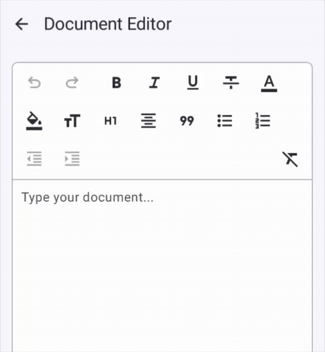
</div>

> [!WARNING]
> **Work In Progress**: This library is currently under active development. APIs are unstable and subject to change without notice. We highly welcome your feedback, feature requests, and bug reports via GitHub Issues!

## Supported Platforms

| Platform | Support Status | Target |
| :--- | :---: | :--- |
| **Android** | ✅ Supported | API Level 26+ |
| **Desktop (JVM)** | ✅ Supported | macOS, Windows, Linux |
| **iOS** | ✅ Supported | - |
| **Web** | ✅ Supported | WasmJs |

## Requirements
* **Kotlin 2.3.20+**

## Core Features

* 🛡️ **Type-Safe Custom Attributes:** Define and apply UI-specific styles (like `SpanStyle`) and domain-specific attributes (e.g., `@Mention`, `#Hashtag`, `LinkKey`) with full compile-time safety.
* ⚡ **High-Level Editor Behaviors:** Built-in paragraph formatting (Headings, Blockquotes, Alignments, Bullet & Ordered Lists), dynamic enter-key strategies, and robust Undo/Redo history tracking.
* 🔄 **Declarative & Type-Safe Mutation DSL:** Atomically mutate text and apply rich attributes within a type-safe builder DSL, eliminating manual index calculations and ensuring synchronized state.
* 🔍 **Semantic "Runs":** Treat text not just as characters, but as "Runs" (chunks of text with identical attributes) for semantic iteration, searching, and batch editing.
* 🌐 **Markdown & HTML Interoperability (Planned):** Bi-directional import/export converters and live WYSIWYG auto-formatting while typing.
* 🧩 **Native Compose Multiplatform Integration:** Elegantly separate headless core state management (`RichTextState`) and UI rendering (`RichTextEditor`) across Android, iOS, Desktop, and Web.

## Why Arranger?

While Compose 1.12+ provides fundamental primitives (`TextField`, `addStyle`), building a production-grade rich text editor (such as Notion, Bear, or Slack) requires a higher-level engine to orchestrate complex editing interactions. Arranger delivers that complete editor framework.

### 1. Declarative & Type-Safe Mutation DSL
Standard text components require manual index math and string concatenation. Arranger provides a declarative, type-safe builder DSL to atomically mutate text and apply formatting attributes in a single synchronized operation:

```kotlin
// Arranger: Declarative and type-safe text mutation DSL
state.edit {
    insert(index = textLength, text = "New Section") {
        bold()
        headingLevel(HeadingLevel.H2)
    }
}
```

### 2. Out-of-the-Box Editor Behaviors
Building an intuitive editing experience requires orchestrating multi-step formatting rules. Arranger comes with batteries included:
* **Smart Enter Key Handling:** `EnterKeyStrategy` automatically manages list continuations, outdenting, and heading resets on newlines.
* **Dynamic List Marker Resolution:** Automated nested bullet markers and sequence numbering (`ListMarkerResolver`).
* **Atomic Undo / Redo:** Full undo/redo stack tracking both text mutations and formatting changes seamlessly.

### 3. Semantic Attribute Search via "Runs"
Inspired by SwiftUI's `AttributedString.Runs`, Arranger treats text as semantic chunks. You can easily find and batch-edit specific attributes without complex regex or index tracking.

```kotlin
// Arranger: Semantic iteration over attributes via "Runs"
state.edit {
    // Find all chunks of text that are Bold, and turn them Red at once
    val boldRuns = state.richString.runs(BoldKey)
    editAll(boldRuns) {
        textColor(Color.Red)
    }
}
```

## Installation

Arranger is published to Maven Central.

### For Compose Multiplatform (KMP) Projects
Add the dependencies to your `commonMain` source set in `build.gradle.kts`:

```kotlin
kotlin {
    sourceSets {
        commonMain.dependencies {
            // For Compose UI integration (RichTextEditor).
            // This automatically includes the core 'arranger-richtext' module.
            implementation("dev.mkeeda.arranger:arranger-richtext-editor:0.3.0-alpha03")

            // Optional: If you only need the core data structures without Compose UI:
            // implementation("dev.mkeeda.arranger:arranger-richtext:0.3.0-alpha03")
        }
    }
}
```

### For Android-only Projects
Add the dependencies to your top-level `dependencies` block in `build.gradle.kts`:

```kotlin
dependencies {
    implementation("dev.mkeeda.arranger:arranger-richtext-editor:0.3.0-alpha03")
}
```

## Dynamic Editing (Getting Started)

Arranger's true power lies in its ability to handle dynamic text input gracefully. When a user types in the `RichTextEditor`—or when you programmatically insert text into `RichTextState`—existing spans are automatically maintained and shifted. You don't need to write any custom logic to preserve formatting.

```kotlin
@Composable
fun DynamicEditingSample(modifier: Modifier = Modifier) {
    val initialText = "Edit this styled text to see the magic."

    // 1. Initialize state with formatting
    val state = remember {
        RichTextState(
            initialText = RichString(text = initialText).edit {
                editAttributes(range = initialText.rangeOf("styled text")) {
                    bold()
                    textColor(Color(0xFF6200EA)) // Purple
                }
            }
        )
    }

    // 2. Render natively via Compose Multiplatform
    // Try typing in the middle of "styled text"! 
    // Arranger automatically tracks and shifts the span indices in the background.
    RichTextEditor(
        state = state,
        modifier = Modifier.fillMaxWidth(),
    )
}
```

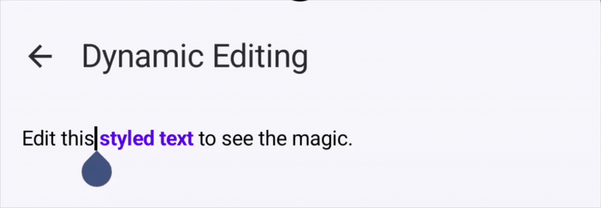

## Paragraph Styles & Advanced Formatting

Arranger natively supports not only inline character formatting (like colors and boldness) but also block-level paragraph formatting such as Headers, Blockquotes, and Alignments.

<details>
<summary><b>Show Code</b></summary>

```kotlin
@Composable
fun AdvancedFormattingSample(modifier: Modifier = Modifier) {
    val initialText =
        "Advanced Formatting Options\n" +
            "You can easily apply various text and paragraph styles.\n\n" +
            "Paragraph Styling\n" +
            "This paragraph is explicitly centered, overriding the default alignment.\n" +
            "> Blockquotes are perfect for highlighting external quotes or important notes."

    val state =
        remember {
            RichTextState(
                initialText =
                    RichString(text = initialText).edit {
                        editAttributes(range = initialText.rangeOf("Advanced Formatting Options")) {
                            headingLevel(HeadingLevel.H1)
                        }
                        editAttributes(range = initialText.rangeOf("Paragraph Styling")) {
                            headingLevel(HeadingLevel.H3)
                        }
                        editAttributes(range = initialText.rangeOf("This paragraph is explicitly centered, overriding the default alignment.")) {
                            textAlignment(TextAlignment.Center)
                        }
                        editAttributes(range = initialText.rangeOf("> Blockquotes are perfect for highlighting external quotes or important notes.")) {
                            blockquote()
                        }
                        editAttributes(range = initialText.rangeOf("various text and paragraph styles")) {
                            textColor(Color(0xFFE91E63)) // Pink
                            bold()
                            underline()
                        }
                    },
            )
        }

    RichTextEditor(
        state = state,
        modifier = Modifier.fillMaxWidth(),
    )
}
```

</details>

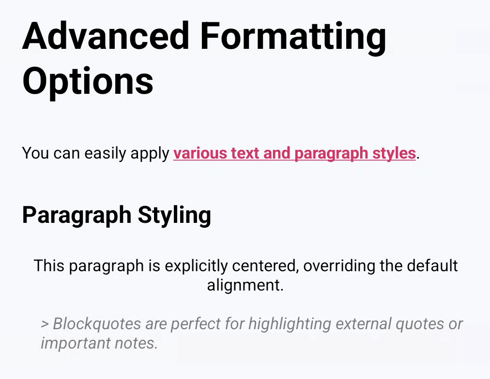

## Lists & Ordered Lists

Arranger provides native support for `bulletList` and `orderedList` paragraph formatting. You can apply list attributes over a text range, and the editor will automatically render the appropriate markers and handle indentation.

### Bullet Lists
Bullet lists automatically change their marker symbol based on the indentation level (e.g., Level 1 uses `・`, Level 2 uses `○`).

<details>
<summary><b>Show Code</b></summary>

```kotlin
@Composable
fun BulletListSample(modifier: Modifier = Modifier) {
    val initialText = "Bullet Items:\n" +
            "First item\n" +
            "Second item\n" +
            "Third item\n" +
            "Nested item 1\n" +
            "Nested item 2"

    val state = remember {
        RichTextState(
            initialText = RichString(text = initialText).edit {
                val itemsStart = initialText.indexOf("First item")
                val itemsEnd = initialText.indexOf("Nested item 1") - 1
                editAttributes(itemsStart until itemsEnd) {
                    bulletList(ListIndentLevel.Level1)
                }

                val nestedStart = initialText.indexOf("Nested item 1")
                val nestedEnd = initialText.length
                editAttributes(nestedStart until nestedEnd) {
                    bulletList(ListIndentLevel.Level2)
                }
            }
        )
    }

    RichTextEditor(
        state = state,
        modifier = modifier.fillMaxWidth(),
    )
}
```

</details>

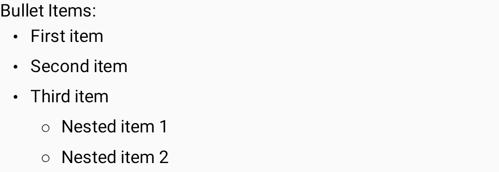

### Ordered Lists
Ordered lists automatically calculate and display the sequence numbers based on their position and nesting level.

<details>
<summary><b>Show Code</b></summary>

```kotlin
@Composable
fun OrderedListSample(modifier: Modifier = Modifier) {
    val initialText = "Steps to follow:\n" +
            "Prepare ingredients\n" +
            "Cook the meal\n" +
            "Serve on plates"

    val state = remember {
        RichTextState(
            initialText = RichString(text = initialText).edit {
                val start = initialText.indexOf("Prepare ingredients")
                val end = initialText.length
                editAttributes(start until end) {
                    orderedList(ListIndentLevel.Level1)
                }
            }
        )
    }

    RichTextEditor(
        state = state,
        modifier = modifier.fillMaxWidth(),
    )
}
```

</details>


### Custom List Markers
You can customize the list markers by providing a `ListMarkerResolver` to the `RichTextEditor`. This allows you to use different symbols, letters, or parentheses for your lists.

<details>
<summary><b>Show Code</b></summary>

```kotlin
private val customMarkerResolver = ListMarkerResolver { item ->
    when (item) {
        is BulletListItem -> "✔️ "
        is OrderedListItem -> "${('a' + item.index - 1)}) "
    }
}

@Composable
fun CustomListMarkerSample(modifier: Modifier = Modifier) {
    val initialText = "Checklist:\n" +
            "Review code\n" +
            "Run tests\n" +
            "Deploy\n" +
            "Priorities:\n" +
            "Critical bugs\n" +
            "New features\n" +
            "Refactoring"

    val state = remember {
        RichTextState(
            initialText = RichString(text = initialText).edit {
                val start = initialText.indexOf("Review code")
                val end = initialText.indexOf("Priorities:") - 1
                editAttributes(start until end) {
                    bulletList(ListIndentLevel.Level1)
                }

                val orderedStart = initialText.indexOf("Critical bugs")
                val orderedEnd = initialText.length
                editAttributes(orderedStart until orderedEnd) {
                    orderedList(ListIndentLevel.Level1)
                }
            }
        )
    }

    RichTextEditor(
        state = state,
        modifier = modifier.fillMaxWidth(),
        listMarkerResolver = customMarkerResolver,
    )
}
```

</details>

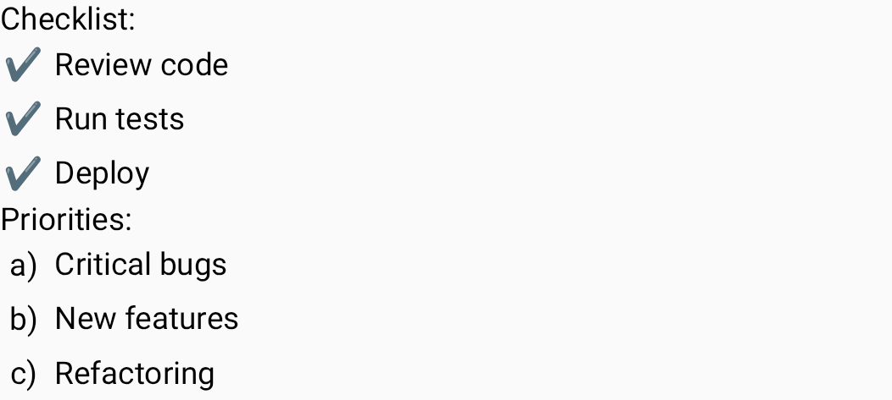

## Dynamic Enter Key Handling

Arranger provides intelligent formatting strategies when the user presses the Enter key. By providing an `EnterKeyStrategy` to the `RichTextEditor`, you can control how paragraph attributes are inherited or transformed on new lines.

The library includes three built-in strategies:

| Strategy | Description | Demo |
| :--- | :--- | :--- |
| **`InheritParagraphStrategy`**<br>(Default) | Inherits all paragraph attributes (like alignment or blockquote) to the new line. | 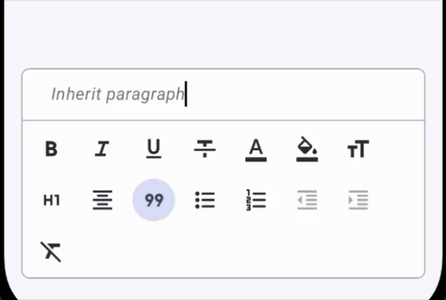 |
| **`ListEnterStrategy`** | Inherits list attributes and automatically increments ordered list numbers. Pressing Enter on an empty list item will decrease its indentation level (outdent). If the item is at the first level, the list attribute is removed. | 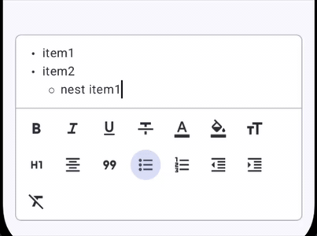 |
| **`HeadingEnterStrategy`** | Automatically removes the heading attribute on the new line, allowing users to quickly start typing normal text after a heading. | 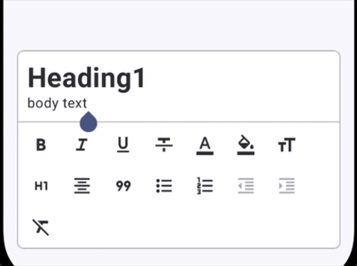 |

You can combine these strategies (or create your own custom strategies) to build a seamless editing experience.

## Hyperlinks & URL Detection

Arranger provides native support for rich hyperlinks with `LinkKey`. You can apply links to text ranges, automatically detect URLs in plain text, and provide seamless tap/click navigation across all platforms.

### Applying Hyperlinks
You can apply a URL link to a selected range using the standard `applyFormat(LinkKey, url)` extension on `RichTextState`, or `link(url)` within a `RichString` builder:

<details>
<summary><b>Show Code</b></summary>

```kotlin
@Composable
fun HyperlinkSample(modifier: Modifier = Modifier) {
    val initialText = "Visit Kotlin website or Google for search."

    val state =
        remember {
            RichTextState(
                initialText =
                    RichString(text = initialText).edit {
                        editAttributes(range = initialText.rangeOf("Kotlin website")) {
                            link("https://kotlinlang.org")
                        }
                        editAttributes(range = initialText.rangeOf("Google")) {
                            link("https://google.com")
                        }
                    },
            )
        }

    RichTextEditor(
        state = state,
        modifier = modifier.fillMaxWidth(),
    )
}
```

</details>

### Interactive Tap / Click Handling
`RichTextEditor` automatically styles links (blue text with underline by default) and handles tap/click gestures:
* **Native Navigation:** Clicking or tapping a hyperlink automatically invokes Compose's standard `LocalUriHandler.current.openUri(url)`.
* **Custom URI Handlers:** To customize link navigation behavior (e.g., in-app web views or custom routing), provide a custom handler using standard Compose `CompositionLocalProvider(LocalUriHandler provides customUriHandler)`.

### URL Parsing & Auto-Linking
Arranger includes a pure Kotlin `UrlParser` utility that detects URLs in plain text and normalizes them (e.g., prepending `https://` to `www.` domains).
To automatically scan the document and apply `LinkKey` spans to all detected URLs in one atomic transaction, use `state.detectAndApplyLinks()`:

```kotlin
// Automatically detects URLs and applies LinkKey spans (preserving existing custom links)
state.detectAndApplyLinks()
```

## Custom Attribute Mapping

You can define custom attribute keys and map them to Compose styles. Below shows an example of implementing a simple highlight feature by creating a custom `SpanAttributeKey` and styling it with an `AttributeStyleResolver`.

> [!TIP]
> If you are building a Material 3 application, consider using `rememberMaterial3AttributeStyleResolver()` from the `arranger-richtext-editor-material3` artifact. It automatically resolves standard text formats (like headings and blockquotes) using your app's `MaterialTheme` typography and color schemes.
> 
> To use it, add the following dependency to your module's `build.gradle.kts`:
> ```kotlin
> dependencies {
>     implementation("dev.mkeeda.arranger:arranger-richtext-editor-material3:0.3.0-alpha03")
> }
> ```

<details>
<summary><b>Show Code</b></summary>

```kotlin
// 1. Define Custom Attribute Key
object HighlightKey : SpanAttributeKey<Unit> {
    override val name: String = "Highlight"
    override val defaultValue: Unit = Unit
}

// 2. Create a custom AttributeStyleResolver inheriting from DefaultAttributeStyleResolver
private val customResolver = AttributeStyleResolver(base = DefaultAttributeStyleResolver) {
    spanStyle(HighlightKey) {
        SpanStyle(
            background = Color(0xFFFFF59D), // Light Yellow
            color = Color(0xFFE65100),      // Orange Text
            fontWeight = FontWeight.ExtraBold
        )
    }
}

@Composable
fun CustomAttributeSample(modifier: Modifier = Modifier) {
    val initialText = "Arranger also supports Custom Attributes.\nThis text is highlighted using a custom resolver!"

    // 3. Initialize RichTextState with the custom attribute
    val state = remember {
        RichTextState(
            initialText = RichString(text = initialText).edit {
                val range = initialText.rangeOf("highlighted")
                setSpanAttribute(HighlightKey, Unit, range)
            }
        )
    }

    // 4. Pass the custom resolver to RichTextEditor
    RichTextEditor(
        state = state,
        styleResolver = customResolver,
        modifier = modifier.fillMaxWidth(),
    )
}
```

</details>

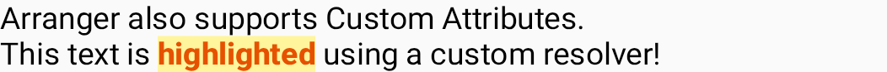

## Semantic Batch Editing (Searching & Querying)

Arranger treats text as semantic "Runs" (chunks of text with identical attributes). This allows you to effortlessly search for patterns or query existing attributes, and modify them all at once.

### Searching and Highlighting
You can easily search for strings or regular expressions and apply styles to all occurrences at once using `rangesOf` and `editAll`. Here's a sample that highlights hashtags in real-time.

<details>
<summary><b>Show Code</b></summary>

```kotlin
@Composable
fun HashtagHighlightSample(modifier: Modifier = Modifier) {
    val initialText = "Type some #hashtags here!\nFor example: #Compose is #awesome"

    val state = remember {
        RichTextState(
            initialText = RichString(text = initialText)
        )
    }

    LaunchedEffect(state) {
        snapshotFlow { state.richString.text }.collect { text ->
            state.edit {
                // Clear existing colors first
                editAttributes(range = text.indices) {
                    clearTextColor()
                }
                
                // Find all hashtags and highlight them in blue
                val hashtagRanges = text.rangesOf(Regex("#\\w+"))
                editAll(hashtagRanges) {
                    textColor(Color(0xFF1976D2)) // Blue
                }
            }
        }
    }

    RichTextEditor(
        state = state,
        modifier = modifier.fillMaxWidth(),
    )
}
```

</details>

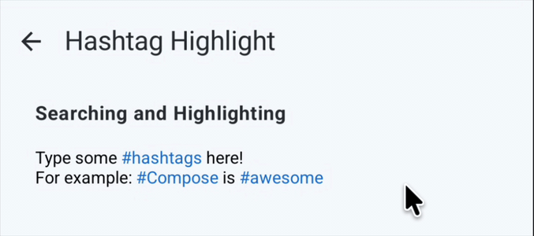

### Querying and Modifying Attributes
Instead of text searching, you can also query existing attributes using `runs(key)` and apply a batch edit over those specific runs. This is useful for semantic manipulations like changing the color of all bold texts.

> [!NOTE]
> For more complex queries, you can also use `runs { predicate }` to extract runs that match any custom condition based on their attributes.

<details>
<summary><b>Show Code</b></summary>

```kotlin
@Composable
fun AttributeBatchEditSample(modifier: Modifier = Modifier) {
    val initialText = "This text has some bold words.\n" +
            "We can find all bold parts and change their color at once."

    val state = remember {
        RichTextState(
            initialText = RichString(text = initialText).edit {
                editAttributes(range = initialText.rangeOf("bold words")) {
                    bold()
                }
                editAttributes(range = initialText.rangeOf("bold parts")) {
                    bold()
                }
            }
        )
    }

    Column(modifier = modifier) {
        Button(
            onClick = {
                // Find all runs that have the BoldKey
                val boldRuns = state.richString.runs(BoldKey)
                
                // Batch edit those specific runs
                state.edit {
                    editAll(boldRuns) {
                        textColor(Color(0xFFD32F2F)) // Red
                    }
                }
            },
            modifier = Modifier.fillMaxWidth()
        ) {
            Text("Highlight Bold Text in Red")
        }
        
        Spacer(modifier = Modifier.height(16.dp))

        RichTextEditor(
            state = state,
            modifier = Modifier.fillMaxWidth(),
        )
    }
}
```

</details>

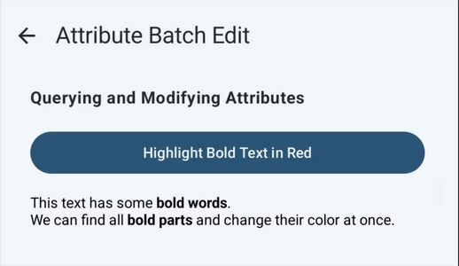

## Atomic Text Mutations

Arranger allows you to programmatically mutate text (`insert`, `delete`, `replace`) and apply formatting atomically within the `RichTextState.edit { }` block.
The `RichTextBuffer` automatically shifts existing spans to maintain alignment and allows you to apply new attributes safely to the newly inserted text.

<details>
<summary><b>Show Code</b></summary>

```kotlin
@Composable
fun AtomicMutationSample(modifier: Modifier = Modifier) {
    val state = remember {
        RichTextState(initialText = RichString(text = "Hello "))
    }

    Column(modifier = modifier.padding(16.dp)) {
        Text("Atomic Text Mutations", fontWeight = FontWeight.Bold)
        Spacer(modifier = Modifier.height(16.dp))

        Button(
            onClick = {
                state.edit {
                    // Atomically insert text and apply styles to the newly inserted text
                    insert(index = textLength, text = "World!") {
                        bold()
                        textColor(Color(0xFFE91E63)) // Pink
                    }
                    
                    // You can also delete or replace text:
                    // delete(range = 0..5)
                    // replace(range = 0..5, text = "Hi, ") { italic() }
                }
            },
            modifier = Modifier.fillMaxWidth()
        ) {
            Text("Insert Styled Text")
        }

        Spacer(modifier = Modifier.height(16.dp))

        RichTextEditor(
            state = state,
            modifier = Modifier.fillMaxWidth(),
        )
    }
}
```

</details>

## Undo / Redo

Arranger provides a built-in, robust Undo/Redo engine that automatically records text mutations and attribute changes. The history state is exposed via `state.undoState`, allowing you to easily build undo/redo toolbars or handle keyboard shortcuts.

The engine correctly manages complex operations like batch attribute application or atomic text replacements as single undoable actions.

<details>
<summary><b>Show Code</b></summary>

```kotlin
@Composable
fun UndoRedoSample(modifier: Modifier = Modifier) {
    val initialText = "Type something here, make changes, and use Undo/Redo buttons."
    val state =
        remember {
            RichTextState(
                initialText = RichString(text = initialText).edit {
                    val range = initialText.rangeOf("Undo/Redo")
                    editAttributes(range = range) {
                        bold()
                        textColor(Color(0xFF1976D2)) // Blue
                    }
                }
            )
        }

    Column(modifier = modifier.padding(16.dp)) {
        Row(
            modifier = Modifier.fillMaxWidth(),
            horizontalArrangement = Arrangement.spacedBy(8.dp)
        ) {
            Button(
                onClick = { state.undoState.undo() },
                enabled = state.undoState.canUndo
            ) {
                Text("Undo")
            }
            Button(
                onClick = { state.undoState.redo() },
                enabled = state.undoState.canRedo
            ) {
                Text("Redo")
            }
            Spacer(modifier = Modifier.weight(1f))
            Button(
                onClick = {
                    state.edit {
                        // textLength is a property of the edit block's receiver — the full character count
                        editAttributes(range = 0 until textLength) { bold() }
                    }
                }
            ) {
                Text("Make All Bold")
            }
        }

        Spacer(modifier = Modifier.height(16.dp))

        RichTextEditor(
            state = state,
            modifier = Modifier.fillMaxWidth().weight(1f),
        )
    }
}
```

</details>

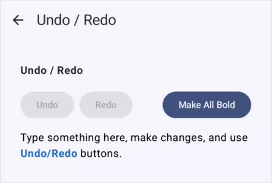

## Practical Examples

Arranger can be used to build rich and complex text input interfaces. Below are some real-world use cases demonstrating how to integrate Arranger into your applications.

| Sample | Screenshot |
| --- | --- |
| **[Document Editor with Full UI](./sample/shared/src/commonMain/kotlin/dev/mkeeda/arranger/sample/shared/DocumentEditorSample.kt)**<br><br>This sample demonstrates a full-screen document editor UI equipped with a rich formatting toolbar.<br>It showcases how to handle text selection, manage undo/redo history, insert hyperlinks via dialogs, and seamlessly integrate state with Compose Multiplatform.<br>This sample app can be run as an Android, iOS, Desktop (macOS, Windows, Linux), and Web (Wasm) app.<br><br>**Tip:** Check this sample to see how you can easily apply formatting using the idiomatic `RichTextState` extension functions (e.g., `toggleFormat()`, `applyFormat()`, `removeFormat()`, and `clearFormats()`). | 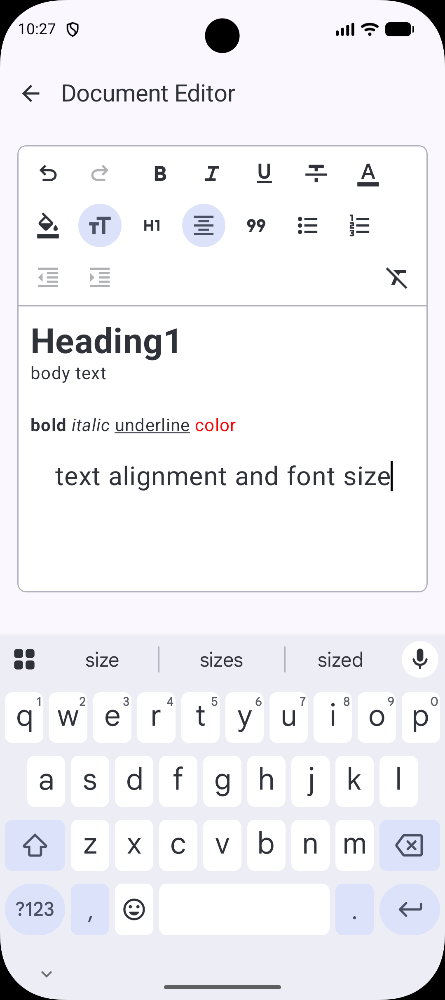 |

### Running the Sample Applications

You can run the sample application on any of the supported platforms:

- **Web (Wasm):** `./gradlew :sample:web:wasmJsBrowserDevelopmentRun`
- **Desktop:** `./gradlew :sample:desktop:run`
- **Android:** Open the project in Android Studio and run the `:sample:android` configuration.
- **iOS:** Open `sample/ios/ArrangerSample.xcodeproj` in Xcode and press **Run (Cmd + R)**.

## Core Architecture Overview
To ensure scalability up to PC-class text sizes and pure Kotlin compatibility (KMP), the architecture is layered:

### Pure Kotlin Core (Data Structures)
* **`RichString` & `RichRun`**: Immutable representations of text and its semantic chunks.
* **`AttributeKey<T>`**: Defines the data type of an attribute.
* **`AttributeContainer`**: A core structure holding a type-safe map of attributes, which is associated with specific text ranges to form `RichSpan`s.
* **`RichStringScope`**: A builder scope used to safely mutate the attributes of a string within an `edit` block. Designed to accumulate attribute mutations and produce a completely new, immutable `RichString`.

### Compose UI Layer
* **`RichTextState`**: Wraps `TextFieldState` and manages the Spans. It acts as the single source of truth and exposes the complete `RichString`.
* **`RichTextBuffer`**: A state-backed buffer provided inside `RichTextState.edit { }` that allows atomic, programmatic text and attribute mutations while automatically keeping spans synchronized.
* **`RichTextOutputTransformation`**: Converts the plain text and spans into Compose's `AnnotatedString` purely at render time.
* **`RichTextEditor`**: A simple, declarative Composable wrapping `BasicTextField` with our state and transformation.

## Development Roadmap

Arranger is evolving towards a stable **v1.0.0 (Production-Ready Release)**.

With the release of **Compose 1.12**, we have pivoted our focus toward delivering a comprehensive **High-Level Rich Text Editor Engine**:
* **v0.3.x (Strategic Pivot & Baseline):** Compose 1.12 compatibility verification and positioning pivot.
* **v0.4.0 – v0.5.0 (High Priority Focus):** Markdown/HTML interop, WYSIWYG auto-formatting, interactive links/mentions, and visual block decorations.
* **v1.0.0 (Production Readiness):** Internal adoption of Compose 1.12 native `TrackedRange` primitives across all multiplatform targets, API freeze, and LTS stability.

For the complete version release plan, detailed milestone breakdown, and post-1.0.0 roadmap, please see [ROADMAP.md](ROADMAP.md).

## Contributing
Contributions are welcome! Please see our [CONTRIBUTING.md](CONTRIBUTING.md) for details on how to get started.

## License
This project is licensed under the Apache License 2.0 - see the [LICENSE](LICENSE) file for details.
