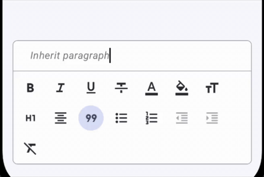
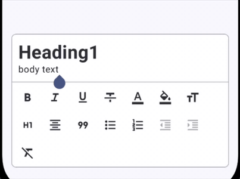
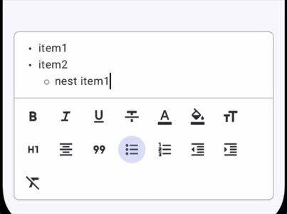

# Paragraph Enter Key Behavior

In rich text editing, pressing the **Enter** key does not merely insert a newline character (`\n`). In document editors, pressing Enter has context-sensitive semantics:

- Within a **heading**, pressing Enter should transition to normal paragraph text rather than continuing the heading style onto the next line.
- Within a **bullet or ordered list**, pressing Enter should spawn the next list item at the current indentation level. Pressing Enter on an empty list item should outdent or exit list mode entirely.
- Within **block quotes** or **code blocks**, pressing Enter should preserve block nesting or indentation until explicitly terminated.

Arranger provides a clean, pluggable extension model via `EnterKeyStrategy` to control exactly how newlines alter paragraph and block attributes.

---

## The EnterKeyStrategy Architecture

The core `:richtext` module defines the strategy interface and its invocation context:

```kotlin
package dev.mkeeda.arranger.richtext

public interface EnterKeyStrategy {
    public fun execute(context: EnterKeyContext): EnterKeyResult
}
```

Whenever the user presses Enter (or soft-keyboard newline), Arranger captures the current paragraph context and invokes the strategy associated with the current paragraph's `ParagraphAttributeKey`.

### EnterKeyContext

`EnterKeyContext` provides the contextual snapshot before the newline is committed:

```kotlin
public data class EnterKeyContext(
    val text: String,
    val cursorPosition: Int,
    val paragraphRange: IntRange,
    val currentAttributes: AttributeContainer,
)
```

- `text`: The entire plain text string of the buffer before newline insertion.
- `cursorPosition`: The character offset where the newline was triggered.
- `paragraphRange`: The `IntRange` spanning the current paragraph (from the start of the line to the ending newline or end of text).
- `currentAttributes`: The block-level attributes applied to the active paragraph.

### EnterKeyResult

`EnterKeyResult` is a sealed interface representing one of three mutation outcomes:

```kotlin
public sealed interface EnterKeyResult {
    /**
     * Inherit the specified attributes for the newly created paragraph.
     * The newline is inserted and preserved.
     */
    public data class InheritAttributes(val attributes: AttributeContainer) : EnterKeyResult

    /**
     * Clear block attributes for the newly created paragraph, resulting in a standard paragraph.
     * The newline is inserted and preserved.
     */
    public data object ClearAttributes : EnterKeyResult

    /**
     * Do not insert a newline. Instead, modify the attributes of the current paragraph.
     * Used for outdenting or exiting empty list items.
     */
    public data class Outdent(val attributes: AttributeContainer) : EnterKeyResult
}
```

---

## Built-in Strategies

Arranger bundles four standard implementations out of the box:

| Strategy | Target Key | Behavior on Enter |
|---|---|---|
| `InheritParagraphStrategy` | Default for `ParagraphAttributeKey` and `BlockquoteKey` | Clones all paragraph attributes to the newly created line. |
| `HeadingEnterStrategy` | `HeadingKey` | Clears `HeadingLevel` block attributes on the new line; reverts to standard body text. |
| `ListEnterStrategy` | `BulletListKey`, `OrderedListKey` | On non-empty line: inherits list level.<br>On empty line with `Level2`+: decrements indent level.<br>On empty line with `Level1`: removes list attribute and exits list. |
| `CodeBlockEnterStrategy` | `CodeBlockKey` | On non-empty line: inherits code block formatting.<br>On empty line: removes code block and exits back to normal paragraph via `Outdent`. |

### 1. InheritParagraphStrategy

When typing standard paragraphs, text alignments, or blockquotes, the new line continues the existing block styling.

{ width="600" }

```kotlin
public object InheritParagraphStrategy : EnterKeyStrategy {
    override fun execute(context: EnterKeyContext): EnterKeyResult {
        return EnterKeyResult.InheritAttributes(context.currentAttributes)
    }
}
```

### 2. HeadingEnterStrategy

When writing headings, pressing Enter at the end of or inside a heading splits the block and creates a standard paragraph on the next line.

{ width="600" }

```kotlin
public object HeadingEnterStrategy : EnterKeyStrategy {
    override fun execute(context: EnterKeyContext): EnterKeyResult {
        return EnterKeyResult.ClearAttributes
    }
}
```

### 3. ListEnterStrategy

Lists require dynamic continuation and recursive outdenting:

1. **Continuation**: If the current list item contains text, pressing Enter creates a new list item at the exact same indentation level (`InheritAttributes`).
2. **Outdenting**: If the list item is empty (line contains only whitespace or newline) and indented at `Level2` through `Level6`, pressing Enter cancels newline insertion and reduces the indent level by one step (`Outdent`).
3. **Exiting List**: If an empty list item is at root `Level1`, pressing Enter removes the list key entirely, turning the line back into a normal paragraph (`Outdent(attributes - listKey)`).

{ width="600" }

```kotlin
public object ListEnterStrategy : EnterKeyStrategy {
    override fun execute(context: EnterKeyContext): EnterKeyResult {
        val paragraphText = context.text.substring(context.paragraphRange)
        val isEmpty = paragraphText.isEmpty() || paragraphText == "\n"

        if (!isEmpty) {
            return EnterKeyResult.InheritAttributes(context.currentAttributes)
        }

        val listKey =
            context.currentAttributes.keys
                .filterIsInstance<BlockTypeAttributeKey<ListIndentLevel>>()
                .firstOrNull()
                ?: return EnterKeyResult.ClearAttributes

        val currentLevel = context.currentAttributes.getOrDefault(listKey)
        return if (currentLevel.ordinal > 0) {
            val outdented =
                context.currentAttributes +
                    (listKey to ListIndentLevel.entries[currentLevel.ordinal - 1])
            EnterKeyResult.Outdent(outdented)
        } else {
            EnterKeyResult.Outdent(context.currentAttributes - listKey)
        }
    }
}
```

### 4. CodeBlockEnterStrategy

When writing code inside a `CodeBlockKey`, pressing Enter creates a new line continuing the code block. When Enter is pressed on an empty code block line, the code block is removed, returning the user back to standard body text without leaving trailing empty code lines:

```kotlin
public object CodeBlockEnterStrategy : EnterKeyStrategy {
    override fun execute(context: EnterKeyContext): EnterKeyResult {
        val paragraphText = context.text.substring(context.paragraphRange)
        val isEmpty = paragraphText.isBlank() || paragraphText == "\n"

        return if (isEmpty) {
            // Empty line: exit code block back to normal body text
            EnterKeyResult.Outdent(attributes = context.currentAttributes - CodeBlockKey)
        } else {
            // Line has code: continue code block on next line
            EnterKeyResult.InheritAttributes(attributes = context.currentAttributes)
        }
    }
}
```

---

## Implementing Custom EnterKeyStrategy

Custom block types can define their own Enter key behavior by implementing `EnterKeyStrategy` and attaching it to a `ParagraphAttributeKey` or `BlockTypeAttributeKey`.

### Example: Callout Block Strategy

Consider a Callout block where pressing Enter creates newlines inside the callout, but pressing Enter on an empty line terminates the callout:

```kotlin
public object CalloutKey : BlockTypeAttributeKey<Unit> {
    override val name: String = "callout"
    override val defaultValue: Unit = Unit
    override val enterKeyStrategy: EnterKeyStrategy = CalloutEnterStrategy
}

public object CalloutEnterStrategy : EnterKeyStrategy {
    override fun execute(context: EnterKeyContext): EnterKeyResult {
        val currentLineText = context.text.substring(context.paragraphRange).trimEnd('\n')

        return if (currentLineText.isEmpty()) {
            EnterKeyResult.Outdent(context.currentAttributes - CalloutKey)
        } else {
            EnterKeyResult.InheritAttributes(context.currentAttributes)
        }
    }
}
```

---

## Summary

- Every paragraph attribute in Arranger specifies an `enterKeyStrategy`.
- `InheritParagraphStrategy` duplicates block attributes on newline.
- `HeadingEnterStrategy` resets paragraph attributes back to default body text.
- `ListEnterStrategy` handles continuation, multi-level outdenting, and clean list termination without leaving stray newlines.
- `CodeBlockEnterStrategy` preserves code block context and exits cleanly on empty lines.
- Use custom strategies for rich block types like Callouts, Warning Boxes, or Checklists.
