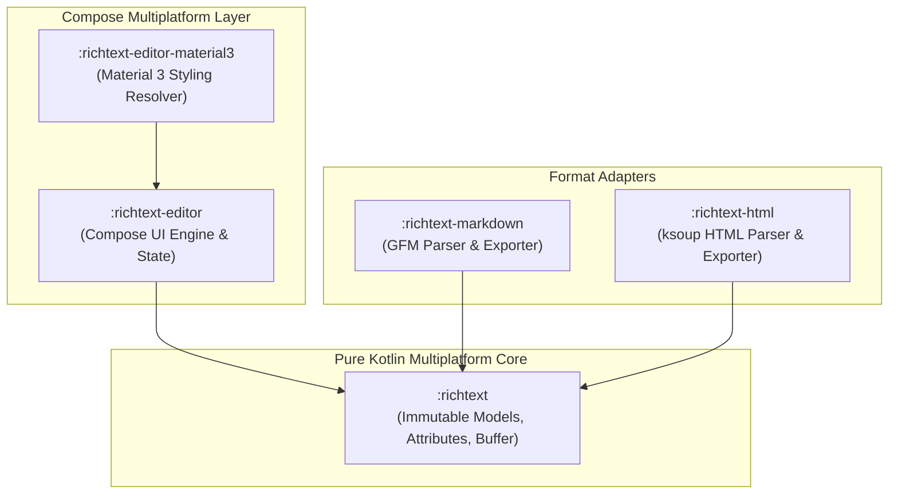

# API Reference Overview

Arranger is architected as a modular, multi-tier rich text framework for Compose Multiplatform. This section provides an architectural map of all library modules, Maven coordinates, and direct links to both conceptual guides and the interactive Dokka KDoc reference.

---

## Interactive Dokka KDoc Reference

For comprehensive, auto-generated documentation of all classes, functions, properties, and type signatures across all platforms (Android, JVM Desktop, iOS, and WasmJs), explore the interactive Dokka documentation:

👉 **[Interactive Dokka API Reference](https://mkeeda.github.io/arranger/api/dokka/)** *(or `/arranger/api/dokka/` on the live site)*

---

## Module Architecture & Coordinates

Arranger is divided into 5 focused modules to keep the core pure and allow applications to selectively include only needed functionality (e.g. headless core vs Compose UI vs format serializers).



| Module | Maven Coordinate | Responsibility & Key Features | Guide & Dokka Links |
|---|---|---|---|
| **`:richtext`** | `dev.mkeeda.arranger:arranger-richtext:0.4.0-alpha03` | **Pure KMP Core Model**. Zero UI dependencies. Houses `RichString`, `RichSpan`, `AttributeContainer`, `AttributeKey`, sweep-line span merging, and paragraph snapping. | [Module Guide](richtext.md) · [Dokka Reference](https://mkeeda.github.io/arranger/api/dokka/richtext/) |
| **`:richtext-editor`** | `dev.mkeeda.arranger:arranger-richtext-editor:0.4.0-alpha03` | **Compose UI Engine**. Houses `RichTextEditor`, `WysiwygEditor`, `RichTextState`, typing attributes, undo/redo history, autocomplete, and span clicks. | [Module Guide](richtext-editor.md) · [Dokka Reference](https://mkeeda.github.io/arranger/api/dokka/richtext-editor/) |
| **`:richtext-editor-material3`** | `dev.mkeeda.arranger:arranger-richtext-editor-material3:0.4.0-alpha03` | **Material 3 Integration**. Maps Arranger style keys (H1-H6, blockquote) to current `MaterialTheme.typography` and `MaterialTheme.colorScheme`. | [Module Guide](richtext-editor-material3.md) · [Dokka Reference](https://mkeeda.github.io/arranger/api/dokka/richtext-editor-material3/) |
| **`:richtext-markdown`** | `dev.mkeeda.arranger:arranger-richtext-markdown:0.4.0-alpha03` | **Markdown Interoperability**. Bi-directional import and export between `RichString` and CommonMark / GFM strings via JetBrains `markdown`. | [Module Guide](richtext-markdown.md) · [Dokka Reference](https://mkeeda.github.io/arranger/api/dokka/richtext-markdown/) |
| **`:richtext-html`** | `dev.mkeeda.arranger:arranger-richtext-html:0.4.0-alpha03` | **HTML Interoperability**. Bi-directional import and export between `RichString` and HTML with inline CSS styling support via `ksoup`. | [Module Guide](richtext-html.md) · [Dokka Reference](https://mkeeda.github.io/arranger/api/dokka/richtext-html/) |

---

## Dependency Configuration

To use Arranger in your Compose Multiplatform project, add the necessary artifacts to your `commonMain` dependencies block in `build.gradle.kts`:

```kotlin
kotlin {
    sourceSets {
        commonMain.dependencies {
            // Core editor UI engine (automatically pulls in :richtext)
            implementation("dev.mkeeda.arranger:arranger-richtext-editor:0.4.0-alpha03")

            // Optional: Material 3 styling integration
            implementation("dev.mkeeda.arranger:arranger-richtext-editor-material3:0.4.0-alpha03")

            // Optional: Markdown and HTML import/export support
            implementation("dev.mkeeda.arranger:arranger-richtext-markdown:0.4.0-alpha03")
            implementation("dev.mkeeda.arranger:arranger-richtext-html:0.4.0-alpha03")
        }
    }
}
```

For non-UI backend or CLI modules that process or convert formatted text, you can depend solely on the pure KMP core or parsers without bringing in Compose UI:

```kotlin
dependencies {
    implementation("dev.mkeeda.arranger:arranger-richtext:0.4.0-alpha03")
    implementation("dev.mkeeda.arranger:arranger-richtext-markdown:0.4.0-alpha03")
}
```

---

## Navigating the Guides vs Dokka

- **Topic Guides** (left sidebar): Read the topic-focused chapters under **Editor Basics**, **Styling & Formatting**, **Advanced Behaviors**, and **Interactive Features** for architecture walkthroughs, design rationale, copy-paste snippets, and best practices.
- **Module Reference Guides** (`docs/api/*.md`): Consult the sub-pages in this section for concise summaries of each module's exported types, contracts, and error semantics.
- **Interactive Dokka Reference**: Use the Dokka KDoc documentation for comprehensive class inheritance trees, method parameter signatures, default argument values, and platform target availability.
