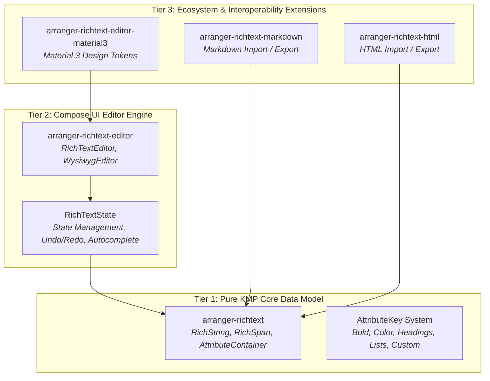
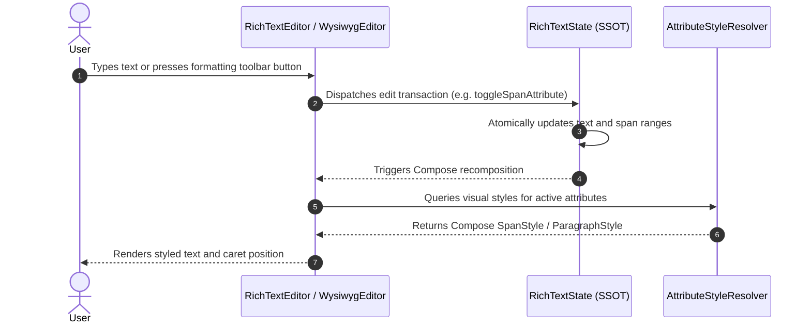

# Architecture Overview

Arranger is designed to solve a central challenge in modern UI development: **high-performance, extensible, and predictable rich text editing on Kotlin Multiplatform and Jetpack Compose**.

Instead of coupling text layout, styling models, and platform widgets into an opaque monolith, Arranger is strictly organized into **three modular layers**.

{ width="600" }

---

## High-Level System Architecture

Arranger divides responsibilities into distinct layers, isolating pure data manipulation from Compose runtime rendering and format converters:

---

## The Three Tiers Explained

### Tier 1: Pure KMP Core (`arranger-richtext`)

The foundation of Arranger is completely decoupled from UI toolkits, Android SDKs, and Compose runtimes. It is written in pure Kotlin standard library and targets JVM, Android, iOS, macOS, Windows, Linux, and Web (WasmJs).

- **Immutable Data Structures:** `RichString` encapsulates the raw text string and an immutable list of `RichSpan` objects. `AttributeContainer` is a type-safe heterogeneous map holding formatting metadata.
- **Abstract Attribute System:** Attributes are identified by typed `AttributeKey<T>` singletons (`BoldKey`, `TextColorKey`, `HeadingKey`). No UI styles (`SpanStyle`, `ParagraphStyle`) exist in this layer.
- **Universal Format SPI:** `RichTextFormat<T>`, `RichTextExporter<T>`, and `RichTextImporter<T>` interfaces allow pluggable serialization.

!!! tip "Backend & Headless Reuse"
    Because `arranger-richtext` has zero UI dependencies, you can run document validation, formatting migrations, Markdown parsing, or HTML generation in backend services (such as Ktor on JVM), CLI tools, or serverless workers without pulling in any Compose runtime dependencies!

---

### Tier 2: Compose UI Engine (`arranger-richtext-editor`)

Tier 2 brings Arranger's core data structures into Jetpack Compose:

- **State Coordination (`RichTextState`):** Wraps Compose Foundation's modern `TextFieldState` alongside reactive formatting state, providing atomic `edit { ... }` transactions.
- **Editor Components:**
    - `RichTextEditor`: Modern, full-featured rich text editor component for toolbar-driven editing.
    - `WysiwygEditor`: Real-time Markdown shortcut styling editor (e.g. typing `# ` transforms into a heading).
- **Interactive Capabilities:**
    - `onSpanClick`: Tap detection that resolves clicked `RichSpan`s (for hyperlinks, mentions, hashtags) with cursor movement suppression.
    - Autocomplete support (`createPopupPositionProvider`): Context-aware trigger detection with zero-calculation cursor-following popup placement.
    - Undo / Redo: Comprehensive history tracking for both typing and style changes.

---

### Tier 3: Ecosystem Extensions

Pluggable modules built on top of Tiers 1 and 2:

- **`arranger-richtext-editor-material3`:** Provides `rememberMaterial3AttributeStyleResolver()`, automatically mapping headings and blockquotes to `MaterialTheme.typography` and `colorScheme`.
- **`arranger-richtext-markdown`:** Bidirectional Markdown import and export leveraging the JetBrains Markdown parser.
- **`arranger-richtext-html`:** Bidirectional HTML import and export with full inline CSS support.

---

## Core Design Principles

### 1. Immutability First

`RichString`, `RichSpan`, and `AttributeContainer` are strictly immutable value objects. In-memory document states cannot be corrupted by concurrent reads or partial mutations. Any transformation yields a clean, new snapshot.

### 2. Separation of Concerns (Model vs Rendering)

Arranger strictly separates **document structure** from **visual presentation**. A heading is simply `HeadingKey to HeadingLevel.H1` in the data model. Whether H1 renders as 32sp Bold Roboto in Material 3, 28pt Serif in a custom theme, or `# Title` in Markdown is decided downstream by `AttributeStyleResolver` or an exporter.

### 3. Multiplatform Zero-Overhead

No platform wrappers, no JNI, and no native bridges. All formatting logic and parser routines execute in pure Kotlin across all platforms with identical behavior.

### 4. Single Source of Truth

In rich text editing, managing raw text and styled spans as separate states often leads to synchronization drift. Arranger coordinates text and styling atomically inside `RichTextState`, ensuring cursor positions, undo history, and formatting attributes are always in sync.

---

## End-to-End Data Flow

