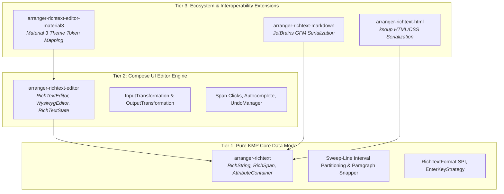
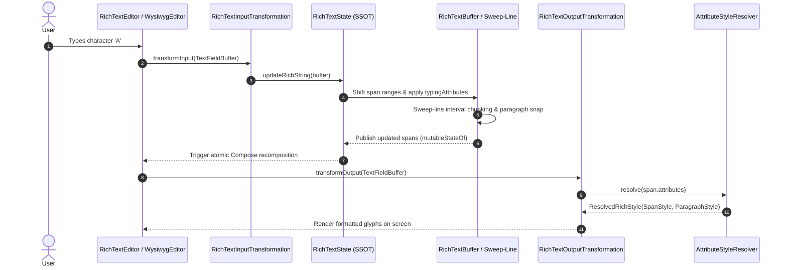

# Architecture Overview

Arranger is engineered from the ground up to solve one of the most notorious challenges in modern UI development: **high-performance, extensible, and predictable rich text editing on Kotlin Multiplatform and Jetpack Compose**.

Unlike monolithic text editors that tightly couple text layout, styling models, and platform widgets into an unwieldy codebase, Arranger is strictly structured around a **three-tier layered architecture**.

{ width="600" }

---

## High-Level System Architecture

Arranger divides responsibilities into distinct layers, isolating pure data manipulation from Compose runtime rendering and third-party format converters:

---

## The Three Tiers Explained

### Tier 1: Pure KMP Core (`:richtext`)

The foundation of Arranger is completely decoupled from UI toolkits, Android SDKs, and Compose runtimes. It is written in pure Kotlin standard library and targets JVM, Android, iOS, macOS, Windows, Linux, and WebAssembly.

- **Immutable Data Structures:** `RichString` encapsulates the raw text string and an immutable list of `RichSpan` objects. `AttributeContainer` is a type-safe heterogeneous map holding formatting metadata.
- **Abstract Attribute System:** Attributes are identified by typed `AttributeKey<T>` singletons (`BoldKey`, `TextColorKey`, `HeadingKey`). No UI styles (`SpanStyle`, `ParagraphStyle`) exist in this layer.
- **Algorithmic Engines:**
    - **Sweep-Line Interval Partitioning (`transformSpans`):** Mathematical interval slicing that guarantees non-overlapping, perfectly tessellated spans during edits.
    - **Paragraph Snapping (`snapToParagraphs`):** Boundary snapping engine ensuring block-level attributes (`HeadingKey`, `BlockquoteKey`, `BulletListKey`) strictly align with newline (`\n`) boundaries.
    - **Enter-Key Decision Engine (`EnterKeyStrategy`):** Pure functional rules defining how block attributes behave when Enter is pressed (e.g. clearing headings or outdenting nested lists).
- **Universal Format SPI:** `RichTextFormat<T>`, `RichTextExporter<T>`, and `RichTextImporter<T>`.

!!! tip "Backend & Headless Reuse"
    Because `:richtext` has zero UI dependencies, you can run document validation, markdown parsing, or HTML generation in backend services (e.g. Ktor on JVM), CLI tools, or serverless workers without pulling in Compose runtime artifacts!

---

### Tier 2: Compose UI Engine (`:richtext-editor`)

Tier 2 bridges Arranger's immutable core data structures into the modern Jetpack Compose text pipeline (Compose Foundation `TextFieldState`):

- **State Coordination (`RichTextState`):** Hoists Compose Foundation's `TextFieldState` alongside reactive `spans` state. Provides atomic `edit { ... }` transactions via `RichTextBuffer`.
- **Bidirectional Transformations:**
    - `RichTextInputTransformation`: Intercepts low-level `TextFieldBuffer` keystrokes, calculates text deltas, shifts existing span offsets, applies active `typingAttributes`, and executes newline inheritance.
    - `RichTextOutputTransformation`: Queries `AttributeStyleResolver` to dynamically apply Compose `SpanStyle` and `ParagraphStyle` decorations to the text layout buffer without altering the underlying raw text.
- **Interactive Capabilities:**
    - `SpanClickEvent`: Pointer tap detection that resolves clicked `RichSpan`s and allows suppressing cursor repositioning via `event.consume()`.
    - `AutocompleteTrigger` & `createPopupPositionProvider`: Context-aware trigger detection (@mentions, #tags) with cursor-relative positioning that handles window clamping, scroll offsets, and vertical flipping.
    - `RichTextUndoManager`: Automatic snapshot history recording with intelligent typing chunk aggregation.
- **WYSIWYG Layer (`WysiwygEditor`):** A specialized composable that inspects keystrokes in real time to expand Markdown shortcuts (`# `, `**bold**`, `* `, `1. `) and supports immediate single-keystroke Backspace reversions.

---

### Tier 3: Ecosystem Extensions

Pluggable modules built on top of Tiers 1 and 2:

- **`arranger-richtext-editor-material3`:** Provides `rememberMaterial3AttributeStyleResolver()`, automatically mapping Arranger's headings and blockquotes to `MaterialTheme.typography` (displayLarge, headlineMedium, etc.) and `colorScheme.onSurfaceVariant`.
- **`arranger-richtext-markdown`:** JetBrains Markdown parser integration with GitHub Flavored Markdown (GFM) support.
- **`arranger-richtext-html`:** Pure KMP `ksoup` integration with full inline CSS parsing.

---

## Core Design Principles

### 1. Immutability First

`RichString`, `RichSpan`, and `AttributeContainer` are strictly immutable value objects. In-memory document states cannot be corrupted by concurrent reads or partial mutations. Any transformation yields a clean, new snapshot.

### 2. Separation of Concerns (Model vs Rendering)

Arranger strictly separates **document structure** from **visual presentation**. A heading is simply `HeadingKey to HeadingLevel.H1` in the data model. Whether H1 renders as 32sp Bold Roboto in Material 3, 28pt Serif in a custom theme, or `# Title` in Markdown is decided downstream by `AttributeStyleResolver` or an exporter.

### 3. Multiplatform Zero-Overhead

No platform wrappers, no JNI, and no native bridges. All formatting logic, boundary calculations, and parser routines execute in pure Kotlin across all platforms with zero overhead.

### 4. Single Source of Truth

In Compose rich text editing, managing dual states (raw text vs styled spans) often leads to drift. Arranger coordinates `TextFieldState` and `spans` atomically inside `RichTextState`, ensuring cursor positions, undo history, and formatting attributes are always synchronized.

---

## End-to-End Data Flow

