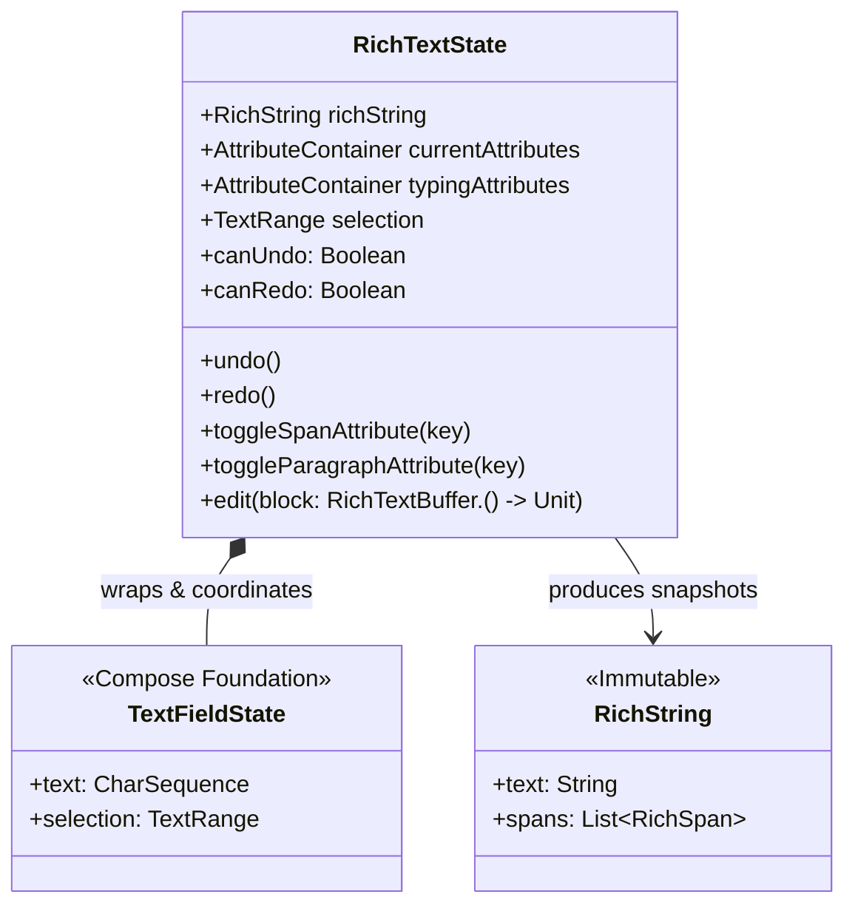
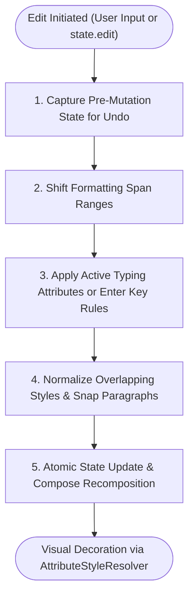

# State Lifecycle & Editing Pipeline

Managing rich text inside a reactive declarative framework like Jetpack Compose presents a fundamental synchronization challenge: text input operates on mutable character buffers and cursor selections, whereas formatting attributes operate on style ranges.

This guide provides an overview of how `RichTextState` maintains synchronization with Compose Foundation's `TextFieldState`, executes atomic edits, and manages undo/redo history.

{ width="600" }

---

## State Coordination Architecture

At the heart of Arranger lies `RichTextState`. Rather than reinventing text selection, cursor kinematics, and IME (Input Method Editor) communication from scratch, Arranger builds directly upon Compose Foundation's `TextFieldState`.



### Immutable Snapshots vs Mutable State

Arranger enforces a clear distinction between observation and mutation:

| Component | Nature | Primary Role |
|---|---|---|
| `RichString` | **Immutable** Value Object | External consumption, serialization (Markdown/HTML), and testing. Accessible via `state.richString`. |
| `RichSpan` | **Immutable** Value Object | Represents a discrete `IntRange` mapped to an `AttributeContainer`. |
| `RichTextState` | **Stable** Reactive State | The Single Source of Truth hoisted across UI components, toolbars, and viewmodels. |
| `RichTextBuffer` | **Ephemeral Mutable** Buffer | Provided as the receiver within `state.edit { ... }` transactions for safe multi-step edits. |

---

## The Edit Transaction Lifecycle

When text is modified — whether through user keyboard input or programmatic toolbar commands — Arranger processes the modification through a predictable pipeline:



### 1. Pre-Mutation Snapshot Recording
Before text or styling is altered, the editor's current state (text, spans, selection, and typing attributes) is captured in the undo stack according to intelligent merging policies (e.g. continuous typing is grouped into a single undo step).

### 2. Automatic Span Range Adjustment
When text is inserted or deleted, existing formatting ranges located at or after the edit position shift automatically, preserving your styling alignment without manual calculation.

### 3. Typing Attributes & Enter Key Strategies
- **Regular Typing:** Characters typed inherit active `typingAttributes` (such as bold or text color selected from a toolbar).
- **Enter Key:** Pressing Enter evaluates the active `EnterKeyStrategy` (e.g. automatically resetting headings to body text, continuing bullet lists, or outdenting nested items).

### 4. Style Normalization & Paragraph Snapping
Intersecting span ranges are automatically normalized to eliminate conflicts. Block-level styles (headings, quotes, lists) are automatically snapped to full paragraph boundaries (`\n` to `\n`).

### 5. Atomic Publication & Recomposition
The state update commits atomically: raw text and span ranges update together. Compose recomposes affected UI nodes, and `AttributeStyleResolver` supplies the corresponding `SpanStyle` and `ParagraphStyle` decorations to the layout.

---

## Undo & Redo Management

Arranger includes built-in undo/redo history tailored specifically for rich text editing.

### Using Undo / Redo in Your UI

You can wire undo and redo actions to toolbar buttons and inspect whether undo or redo is available:

```kotlin
Row(modifier = Modifier.fillMaxWidth()) {
    IconButton(
        onClick = { state.undo() },
        enabled = state.canUndo,
    ) {
        Icon(Icons.Default.Undo, contentDescription = "Undo")
    }

    IconButton(
        onClick = { state.redo() },
        enabled = state.canRedo,
    ) {
        Icon(Icons.Default.Redo, contentDescription = "Redo")
    }
}
```

### Keyboard Shortcuts

Native keyboard shortcuts (<kbd>Cmd/Ctrl</kbd> + <kbd>Z</kbd> and <kbd>Shift</kbd> + <kbd>Cmd/Ctrl</kbd> + <kbd>Z</kbd>) are automatically handled by the editor component.

### Intelligent Keystroke Grouping

To provide a natural undo experience, Arranger automatically groups typing into meaningful undo chunks:

- **Merged Keystrokes:** Continuous typing of words is merged into a single undo step.
- **Isolated Snapshots:** Whitespace, newlines, deletions (Backspace/Delete), multi-character paste operations, and explicit formatting toolbar clicks always create discrete undo checkpoints.

### Memory Safety

Arranger maintains an internal limit of **100 undo steps** by default. When the history reaches capacity, the oldest snapshots are safely dropped in FIFO order.

