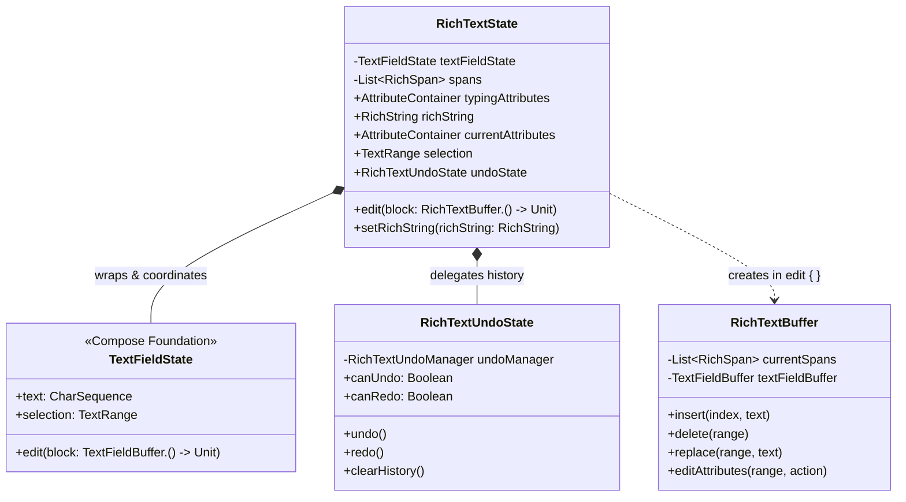
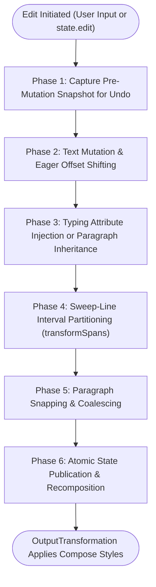

# State Lifecycle & Editing Pipeline

Managing rich text inside a reactive declarative framework like Jetpack Compose presents a fundamental synchronization challenge: text input operates on mutable character buffers and cursor selections, whereas formatting attributes operate on interval trees and style ranges.

This guide provides an in-depth exploration of Arranger's internal state model, examining how `RichTextState` maintains synchronization with Compose Foundation's `TextFieldState`, executes transactional edits, runs sweep-line interval partitioning, and manages undo/redo history.

{ width="600" }

---

## State Coordination Architecture

At the heart of Arranger lies `RichTextState`. Rather than reinventing text selection, cursor kinematics, and IME (Input Method Editor) communication from scratch, Arranger builds directly upon Compose Foundation's `TextFieldState`.



### Immutable Snapshots vs Mutable Buffers

Arranger enforces a strict dichotomy between observation and mutation:

| Component | Nature | Primary Role |
|---|---|---|
| `RichString` | **Immutable** Value Object | External consumption, serialization (Markdown/HTML), and testing. Published via `state.richString`. |
| `RichSpan` | **Immutable** Value Object | Represents a discrete `IntRange` mapped to an `AttributeContainer`. |
| `RichTextState` | **Stable** Reactive State | The Single Source of Truth hoisted across UI components and toolbars. |
| `RichTextBuffer` | **Ephemeral Mutable** Buffer | Provided as the receiver within `state.edit { ... }` transactions. Discarded immediately upon transaction commit. |

---

## The Edit Transaction Lifecycle

When text is modified — whether through user keyboard input or programmatic toolbar commands — Arranger processes the modification through a 6-phase pipeline:



### Phase 1: Pre-Mutation Snapshot & Merge Evaluation

Before any character is altered, `RichTextUndoState.captureSnapshotBeforeChange()` inspects the incoming mutation:

- The current text, span list, cursor selection, and active typing attributes are captured into an `EditorSnapshot`.
- The `UndoMergePolicy` evaluates whether this change should merge with previous keystrokes (e.g. continuous typing of words) or form an isolated undo entry (e.g. whitespace, Backspace, or paste).

### Phase 2: Eager Span Offset Shifting (`shiftSpans`)

When characters are inserted, deleted, or replaced, existing spans located at or after the edit position must adjust their ranges:

```kotlin
// Example: If 5 characters are inserted at index 10:
// A span at 0..8 remains untouched.
// A span at 10..20 expands or shifts to 15..25 depending on insertion boundary rules.
// A span inside a deleted range is clipped or discarded if fully covered.
```

### Phase 3: Typing Attribute & Inheritance Resolution

- **If typing via keyboard:** Active `typingAttributes` are merged into the newly inserted text range.
- **If Enter is pressed:** Arranger consults the active `EnterKeyStrategy` (e.g. `HeadingEnterStrategy`, `ListEnterStrategy`) to determine whether the new paragraph inherits, clears, or outdents block formatting.

### Phase 4: Sweep-Line Interval Partitioning (`transformSpans`)

When multiple overlapping formatting attributes are applied, Arranger resolves overlaps using a sweep-line interval partitioning algorithm:

1. All start and end boundaries from existing spans and the mutation range are extracted into a uniquely sorted list.
2. Adjacent boundary pairs form perfectly tessellated, non-overlapping sub-chunks.
3. Attribute containers are combined for each chunk. Empty containers are discarded.
4. Adjacent chunks with identical attribute sets are merged back together.

### Phase 5: Paragraph Snapping (`resnapParagraphSpans`)

Block attributes (`BlockTypeAttributeKey` such as headings, lists, and blockquotes) and alignment attributes (`AlignmentAttributeKey`) must span complete paragraphs. The snapping engine finds the surrounding newline (`\n`) delimiters and snaps the range to encompass the entire paragraph.

### Phase 6: Snapshot Publication & Recomposition

The transaction commits:

- `textFieldState` updates its raw text.
- `spans` (backed by Compose `mutableStateOf`) updates atomically.
- Recomposition triggers: `RichTextOutputTransformation` receives the new spans, queries `AttributeStyleResolver`, and attaches `SpanStyle` and `ParagraphStyle` annotations to the layout buffer.

---

## Undo/Redo History Stack Management

Arranger features a dedicated undo/redo engine designed specifically for rich text.

```mermaid
sequenceDiagram
    autonumber
    participant App as Application Code
    participant UndoState as RichTextUndoState
    participant UndoMgr as RichTextUndoManager
    participant TFState as TextFieldState

    App->>UndoState: state.undoState.undo()
    UndoState->>UndoMgr: undo(takeSnapshot())
    UndoMgr-->>UndoState: previousSnapshot
    UndoState->>TFState: edit { replace(0, length, snapshot.text); selection = snapshot.selection }
    UndoState->>TFState: undoState.clearHistory()
    UndoState->>UndoState: restoreSpans & restoreTypingAttributes
    UndoState-->>App: UI reverts to previous state
```

### Snapshot Structure (`EditorSnapshot`)

Every snapshot in the undo/redo history preserves complete editor fidelity:

```kotlin
internal data class EditorSnapshot(
    val text: String,
    val spans: List<RichSpan>,
    val selection: TextRange,
    val typingAttributes: AttributeContainer? = null,
    val removedTypingAttributes: Set<AttributeKey<*>>? = null,
)
```

### Intelligent Snapshot Merging (`UndoMergePolicy`)

To prevent the undo stack from requiring one undo per single character typed, Arranger applies intelligent chunking:

- **`UndoMergePolicy.Merge`:** Consecutive single alphanumeric keystrokes without cursor jumps are merged into a single undo step.
- **`UndoMergePolicy.Separate`:** The following operations always force a separate, discrete snapshot:
    1. Whitespace or newline character entry.
    2. Character deletions (Backspace or Delete key).
    3. Multi-character paste operations (`insertedText.length > 1`).
    4. Explicit formatting changes via toolbar or `state.edit`.

### Stack Bounds & Memory Safety

`RichTextUndoManager` enforces a maximum stack size of **100 snapshots**. When capacity is exceeded, the oldest snapshots are dropped first in FIFO order.

### Deep Synchronization with Compose Foundation

When restoring a snapshot during `undo()` or `redo()`, Arranger explicitly clears Compose Foundation's internal `textFieldState.undoState.clearHistory()`. This guarantees that Compose's native shortcut handler (e.g. `Cmd+Z` / `Ctrl+Z`) and Arranger's rich text undo stack never drift out of sync.
