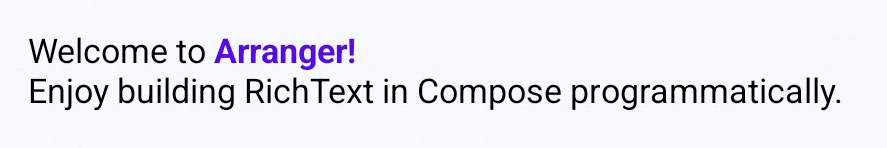

# The Core Rich Text Editor

`RichTextEditor` is the primary Compose editor component of Arranger. It seamlessly integrates rich formatting, bidirectional state synchronization, keyboard shortcuts, interactive span taps, and autocomplete while preserving smooth rendering performance.

<div align="center" markdown>

{ width="500" }

</div>

---

## Basic Usage

Rendering an editor requires only passing a `RichTextState`:

```kotlin
@Composable
fun SimpleEditor() {
    val state = remember { RichTextState() }

    RichTextEditor(
        state = state,
        modifier = Modifier
            .fillMaxSize()
            .padding(16.dp),
    )
}
```

Standard Compose parameters—such as `modifier`, `enabled`, `textStyle`, `keyboardOptions`, `onKeyboardAction`, and `decorator`—are supported with familiar Compose conventions.

For the exhaustive list of parameters and signatures, refer directly to the [RichTextEditor API Reference](https://mkeeda.github.io/arranger/api/richtext-editor/dev.mkeeda.arranger.richtext.editor/-rich-text-editor.html).

---

## Core Capabilities & Patterns

While `RichTextEditor` adheres to standard Compose conventions, it adds rich-text capabilities specifically designed for document editing:

### 1. Custom Style & Marker Resolvers

You can fully customize how attributes and lists are visually rendered by supplying custom resolvers:

- **`styleResolver`**: Translates formatting attributes into Compose `SpanStyle` and `ParagraphStyle`. See [Theming & Material 3](../styling/theming-and-m3.md) and [Custom Attributes](../styling/custom-attributes.md).
- **`listMarkerResolver`**: Controls the prefix markers for bullet points and ordered lists. See [List Handling](../advanced-behaviors/list-handling.md).

### 2. Interactive Span Clicks (`onSpanClick`)

Handle taps on formatted spans (such as links, user mentions, or hashtag badges) with cursor suppression:

```kotlin
RichTextEditor(
    state = state,
    onSpanClick = { event ->
        val url = event.span.attributes[LinkKey]
        if (url != null) {
            println("URL clicked: $url")
            event.consume() // Prevent repositioning the text cursor
        }
    }
)
```

Calling `event.consume()` informs the editor engine that this tap was handled as a link or span action, preventing the text cursor from relocating. See [Interactive Spans & Click Handling](../interactions/span-clicks.md) for full details.

### 3. Read-Only Rich Text Viewer (`readOnly = true`)

By setting `readOnly = true`, the editor functions as a non-editable rich text viewer while preserving text selection and span click interactions:

```kotlin
RichTextEditor(
    state = state,
    readOnly = true,
    onSpanClick = { event ->
        event.span.attributes[LinkKey]?.let { openBrowser(it) }
    }
)
```

### 4. Autocomplete & Mentions

Pass `autocompleteTriggers` (e.g. `@` or `#`) and `onAutocompleteChange` to display suggestion popups anchored to the cursor. See [Autocomplete & Mentions](../interactions/autocomplete.md).

---

## Visual Demo

<div align="center" markdown>

{ width="400" }

</div>

---

## Related Documentation

- [**Markdown Shortcut Editor (WYSIWYG)**](wysiwyg-editor.md): Real-time Markdown shortcut styling editor component.
- [**State Management & History**](state-management.md): Batch edits, typing attributes, and undo/redo history.
- [**Theming and Material 3**](../styling/theming-and-m3.md): Custom styling via `AttributeStyleResolver` and Material 3 token mapping.
