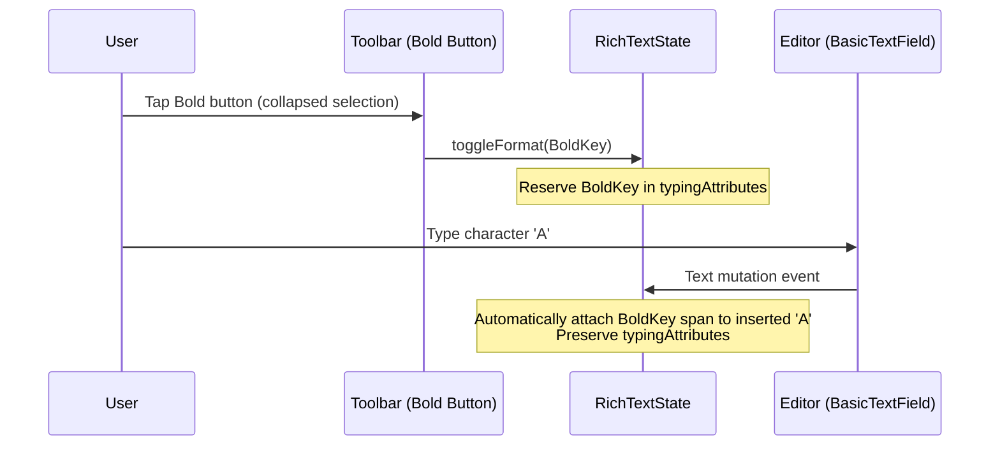

# State Management

State management in Arranger is centered around `@Stable class RichTextState`, strictly adhering to Compose state hoisting principles. It serves as the Single Source of Truth (SSOT), encapsulating text content, attribute spans, cursor selection, undo/redo history, and pending typing attributes.

---

## Core Properties of RichTextState

```kotlin
@Stable
class RichTextState(initialText: RichString = RichString("")) {
    // Immutable data structure holding the current text and all formatted spans
    val richString: RichString

    // Current selection range (cursor position or dragged selection range)
    val selection: TextRange

    // Pending attributes reserved for subsequent keystrokes
    val typingAttributes: AttributeContainer?

    // Effective attributes over the current selection, calculated via logical intersection
    val currentAttributes: AttributeContainer

    // Undo / Redo history management object
    val undoState: RichTextUndoState
}
```

---

## Typing Attributes Lifecycle

In word processors and rich text editors, a standard interaction is tapping the **Bold** button with no text selected, followed by typing characters that appear bold. Arranger models this behavior via `typingAttributes`.

### 1. Reservation Flow



### 2. Attribute Exclusion Reservation (`removedTypingAttributes`)

When toggling bold OFF at the trailing boundary of an existing bold span, `removedTypingAttributes` records the exclusion reservation so subsequent keystrokes revert to unstyled regular text instead of inheriting previous styling.

### 3. Automatic Discard on Caret Relocation

!!! warning "Crucial Lifecycle Behavior"
    If the user moves the cursor (via arrow keys or tapping elsewhere on the screen) after reserving typing attributes without typing any character, **the pending typing attributes are automatically discarded**.

    The effective attributes at the new cursor position (regular text if unstyled, bold if inside a bold span) are immediately re-evaluated into `currentAttributes`.

---

## Current Attributes & Logical Intersection Logic

Determining whether toolbar buttons (such as Bold or Italic) should appear active depends on the user's current selection.

Arranger calculates `state.currentAttributes` using a strict logical intersection algorithm:

1. **Collapsed selection (`selection.collapsed == true`)**:
    - Returns `typingAttributes` if present.
    - Otherwise, returns attributes at the immediate cursor boundary.
2. **Non-collapsed selection (`!selection.collapsed`)**:
    - Returns **only attributes present across 100% of the selected characters**.

### Example Walkthrough

Consider the following formatted string:

> <span style="font-weight: bold; color: blue;">Hello</span> <span style="font-weight: bold;">World</span>

- **Selecting "Hello"**: Both `BoldKey` and `TextColorKey(Blue)` are present across all selected characters and included in `currentAttributes`.
- **Selecting "Hello World"**: Only `BoldKey` is shared across every selected character; `TextColorKey` is excluded because it does not cover "World".
- **Selecting "o W" (boundary)**: Because the intervening space has no formatting, `currentAttributes` is an empty set.

This logical intersection model ensures toolbar buttons can simply query `state.currentAttributes.containsKey(BoldKey)` without manual calculation.

---

## Atomic Batch Mutations with RichTextBuffer

To mutate text content and styling simultaneously, use `state.edit { ... }`. The scoped `RichTextBuffer` provides rich editing operations:

```kotlin
state.edit {
    // 1. Insert text with styles
    insert(index = 0, text = "Title\n") {
        bold()
        headingLevel(HeadingLevel.H1)
    }

    // 2. Replace text range
    replace(range = 10..15, text = "replacement text") {
        italic()
    }

    // 3. Delete text (spans are automatically trimmed/shifted)
    delete(range = 20..25)

    // 4. Apply attributes across existing range
    editAttributes(range = 0 until textLength) {
        textColor(Color.DarkGray)
    }
}
```

Upon exiting the `edit` block, all mutations are committed in a single snapshot, triggering Compose recomposition atomically.

---

## Undo & Redo History (RichTextUndoState)

Arranger includes a built-in undo/redo engine that tracks both plain text modifications and attribute span mutations.

<div align="center" markdown>

{ width="500" }

</div>

### Primary APIs

- `state.undoState.canUndo`: Indicates whether undoable history exists (bind to button `enabled` state).
- `state.undoState.canRedo`: Indicates whether redoable history exists.
- `state.undoState.undo()`: Reverts the most recent operation.
- `state.undoState.redo()`: Reapplies the previously reverted operation.
- `state.undoState.clearHistory()`: Clears the undo/redo history stacks.

### Intelligent Mutation Coalescing

Creating a separate undo entry for every single keystroke forces users to press undo dozens of times just to revert a single word.

Arranger coalesces mutations automatically:

- **Continuous alphanumeric typing**: Coalesced into a single undo step.
- **Whitespace, newlines (Enter), Backspace, and paste events**: Discrete operation boundaries that split coalescing batches.
- **History stack capacity**: Retains the 100 most recent operations to bound memory usage.

---

## Loading External Documents (`setRichString`)

To replace the entire editor content when loading documents or creating new files, use `setRichString`.

```kotlin
val newContent = RichString("New document loaded from external source")
state.setRichString(newContent)
```

Calling `setRichString` safely executes the following operations:

1. Replaces the text and all spans with the new content.
2. Clears pending `typingAttributes`.
3. Resets the undo/redo history stack.
4. Automatically clamps the cursor position to the end of the new text or within valid bounds.

---

## Related Documentation

- [**RichTextEditor Basics**](rich-text-editor.md): Editor component placement and UI parameters.
- [**Spans and Paragraphs**](../styling/spans-and-paragraphs.md): Differences between span and paragraph attributes.
- [**Toolbar Integration**](../interactions/toolbars.md): High-level helper APIs such as `toggleFormat` and focus protection tips.
