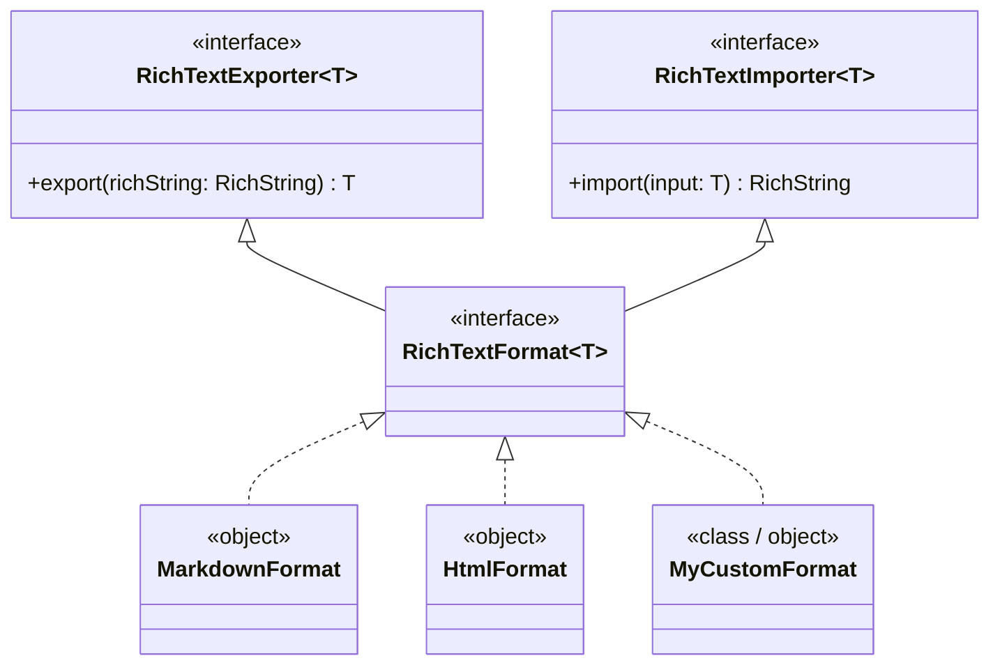

# Custom Formats & Serializers

Arranger features a modular Service Provider Interface (SPI) designed to serialize rich text to and from arbitrary data representations. Whether your application communicates with a Slack API using `mrkdwn`, persists structured rich text in SQLite/PostgreSQL as JSON, or synchronizes collaborative edits using a Delta format, Arranger's format abstraction makes custom format integration straightforward and type-safe.



---

## The Format SPI Architecture

Arranger's format abstraction adheres strictly to the **Interface Segregation Principle**. You can implement an exporter, an importer, or a unified bi-directional format:

```kotlin
package dev.mkeeda.arranger.richtext

public interface RichTextExporter<T> {
    public fun export(richString: RichString): T
}

public interface RichTextImporter<T> {
    public fun import(input: T): RichString
}

public interface RichTextFormat<T> : RichTextExporter<T>, RichTextImporter<T>
```

### Extension Helpers

The core library provides generic extension functions that bridge your implementations directly to `RichString`:

```kotlin
// Export via any exporter
public fun <T> RichString.export(exporter: RichTextExporter<T>): T = exporter.export(this)

// Import via any importer
public fun <T> RichString.Companion.import(input: T, importer: RichTextImporter<T>): RichString = importer.import(input)
```

---

## Implementing a Custom Format: Slack mrkdwn

Slack uses a unique syntax known as `mrkdwn`, which differs from standard CommonMark (for example, `*bold*` instead of `**bold**`, and `_italic_` instead of `*italic*`).

Here is a complete implementation of a bi-directional `SlackMrkdwnFormat`:

### Step 1: Implement the Exporter

We can inspect consecutive styled chunks using `richString.runs`:

```kotlin
import dev.mkeeda.arranger.richtext.BoldKey
import dev.mkeeda.arranger.richtext.ItalicKey
import dev.mkeeda.arranger.richtext.RichString
import dev.mkeeda.arranger.richtext.RichTextExporter
import dev.mkeeda.arranger.richtext.StrikethroughKey

public object SlackMrkdwnExporter : RichTextExporter<String> {
    override fun export(richString: RichString): String {
        if (richString.text.isEmpty()) return ""

        val builder = StringBuilder()
        val text = richString.text

        // Extract styled ranges
        val boldRanges = richString.runs(BoldKey).map { it.range }.toSet()
        val italicRanges = richString.runs(ItalicKey).map { it.range }.toSet()
        val strikeRanges = richString.runs(StrikethroughKey).map { it.range }.toSet()

        // Slicing and wrapping with Slack delimiters (*bold*, _italic_, ~strike~)
        var i = 0
        while (i < text.length) {
            val isBold = boldRanges.any { i in it }
            val isItalic = italicRanges.any { i in it }
            val isStrike = strikeRanges.any { i in it }

            if (isBold && (i == 0 || !boldRanges.any { (i - 1) in it })) builder.append('*')
            if (isItalic && (i == 0 || !italicRanges.any { (i - 1) in it })) builder.append('_')
            if (isStrike && (i == 0 || !strikeRanges.any { (i - 1) in it })) builder.append('~')

            builder.append(text[i])

            if (isStrike && (i == text.lastIndex || !strikeRanges.any { (i + 1) in it })) builder.append('~')
            if (isItalic && (i == text.lastIndex || !italicRanges.any { (i + 1) in it })) builder.append('_')
            if (isBold && (i == text.lastIndex || !boldRanges.any { (i + 1) in it })) builder.append('*')

            i++
        }

        return builder.toString()
    }
}
```

### Step 2: Implement the Importer

We parse the input string and construct a `RichString` with `RichSpan`s:

```kotlin
import dev.mkeeda.arranger.richtext.BoldKey
import dev.mkeeda.arranger.richtext.RichString
import dev.mkeeda.arranger.richtext.RichTextImporter
import dev.mkeeda.arranger.richtext.edit

public object SlackMrkdwnImporter : RichTextImporter<String> {
    private val BOLD_REGEX = Regex("""\*(.*?)\*""")

    override fun import(input: String): RichString {
        return RichString(input).edit {
            BOLD_REGEX.findAll(input).forEach { matchResult ->
                val range = matchResult.range
                setSpanAttribute(BoldKey, Unit, range)
            }
        }
    }
}
```

### Step 3: Combine into a Unified Format

```kotlin
public object SlackMrkdwnFormat : RichTextFormat<String>,
    RichTextExporter<String> by SlackMrkdwnExporter,
    RichTextImporter<String> by SlackMrkdwnImporter

// Idiomatic extension functions
public fun RichString.toSlackMrkdwn(): String = export(SlackMrkdwnFormat)
public fun RichString.Companion.fromSlackMrkdwn(text: String): RichString = import(text, SlackMrkdwnFormat)
```

---

## Implementing JSON Serialization (Database & Network Sync)

For cloud synchronization (e.g. Firebase, Couchbase, Ktor REST APIs), serializing `RichString` into structured JSON is the most reliable strategy.

Using `kotlinx.serialization`:

```kotlin
import kotlinx.serialization.Serializable
import kotlinx.serialization.json.Json
import dev.mkeeda.arranger.richtext.AttributeContainer
import dev.mkeeda.arranger.richtext.BoldKey
import dev.mkeeda.arranger.richtext.HeadingKey
import dev.mkeeda.arranger.richtext.HeadingLevel
import dev.mkeeda.arranger.richtext.ItalicKey
import dev.mkeeda.arranger.richtext.LinkKey
import dev.mkeeda.arranger.richtext.RichSpan
import dev.mkeeda.arranger.richtext.RichString
import dev.mkeeda.arranger.richtext.RichTextFormat

@Serializable
public data class SerializedSpan(
    val start: Int,
    val end: Int,
    val isBold: Boolean = false,
    val isItalic: Boolean = false,
    val headingLevel: String? = null,
    val linkUrl: String? = null,
)

@Serializable
public data class SerializedDocument(
    val text: String,
    val spans: List<SerializedSpan>,
)

public object JsonRichTextFormat : RichTextFormat<String> {
    private val json = Json { prettyPrint = false; ignoreUnknownKeys = true }

    override fun export(richString: RichString): String {
        val serializedSpans = richString.spans.map { span ->
            SerializedSpan(
                start = span.range.first,
                end = span.range.last,
                isBold = span.attributes.containsKey(BoldKey),
                isItalic = span.attributes.containsKey(ItalicKey),
                headingLevel = span.attributes[HeadingKey]?.name,
                linkUrl = span.attributes[LinkKey],
            )
        }
        val doc = SerializedDocument(text = richString.text, spans = serializedSpans)
        return json.encodeToString(SerializedDocument.serializer(), doc)
    }

    override fun import(input: String): RichString {
        val doc = json.decodeFromString(SerializedDocument.serializer(), input)
        val spans = doc.spans.map { s ->
            var attrs = AttributeContainer.empty()
            if (s.isBold) attrs += BoldKey to Unit
            if (s.isItalic) attrs += ItalicKey to Unit
            s.headingLevel?.let { name ->
                runCatching { HeadingLevel.valueOf(name) }.getOrNull()?.let { level ->
                    attrs += HeadingKey to level
                }
            }
            s.linkUrl?.let { url -> attrs += LinkKey to url }
            RichSpan(range = s.start..s.end, attributes = attrs)
        }
        return RichString(text = doc.text, spans = spans)
    }
}
```

---

## Traversal & Parsing Strategies

When designing custom formats, choose the appropriate traversal API provided by `:richtext`:

### 1. Attribute Runs (`richString.runs(key)`)

Returns a `Sequence<RichRun<T>>` combining consecutive characters sharing the exact same attribute value:

```kotlin
richString.runs(BoldKey).forEach { run ->
    println("Bold text '${run.text}' spanning ${run.range}")
}
```

**Best for:** Exporting isolated styles, building run-length encoded formats, or highlighting specific tokens.

### 2. Sweep-Line Boundary Slicing (`transformSpans`)

When multiple overlapping styles must be exported in strictly nested trees (like XML, HTML, or Markdown delimiters):

```kotlin
val boundaries = buildList {
    add(0)
    add(richString.text.length)
    richString.spans.forEach {
        add(it.range.first)
        add(it.range.last + 1)
    }
}.distinct().sorted()
```

**Best for:** Hierarchy-sensitive markup, preventing crossed tags (`<b><i></b></i>`).

### 3. Construction DSL (`RichStringScope`)

When building `RichString` instances inside importers:

```kotlin
RichString("Hello world").edit {
    bold(0..4)
    textColor(RgbaColor(0xFF00FF00), 6..10)
}
```

**Best for:** Programmatic construction with automatic paragraph snapping and span merging.
