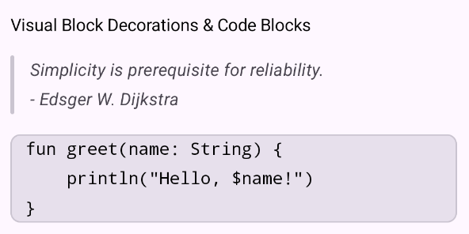

# Visual Block Decorations

Arranger provides a declarative, Composable slot-based architecture for rendering rich container decorations around block-level paragraph elements—such as quote accent bars for **Blockquotes** and rounded background containers with borders for **Code Blocks**.

<div align="center" markdown>

{ width="500" }

</div>

---

## Why Visual Block Decorations?

In standard text editors, paragraph styling is typically confined to typography (such as margins, line height, and font styles). However, modern document editors (such as Notion, GitHub, and Slack) render distinct visual containers around multi-line blocks:

- **Blockquote**: A vertical accent bar running along the left margin of all contiguous quoted lines.
- **Code Block**: A distinct container background, border outline, and monospace styling encompassing all contiguous code lines.

In Compose, rendering background overlays behind dynamic text without layout jitter or coordinate misalignment is notoriously complex. Arranger solves this by decoupling decoration geometry into an overlay layer driven by `BlockDecorator`.

---

## Core Concepts & Architecture

### 1. `VisualBlock` (Automatic Paragraph Merging)

A `VisualBlock` is a sealed interface representing a continuous run of paragraphs sharing the same block-level attribute:

```kotlin
public sealed interface VisualBlock {
    public val range: IntRange

    public data class Blockquote(
        override val range: IntRange,
    ) : VisualBlock

    public data class CodeBlock(
        override val range: IntRange,
        public val language: String? = null,
    ) : VisualBlock
}
```

When users type multi-line code or quotes, adjacent paragraph spans sharing `CodeBlockKey` or `BlockquoteKey` are automatically merged into a single `VisualBlock`.

### 2. `BlockDecorator` & `BlockDecorationContext`

`BlockDecorator` is a composable slot function that receives a `BlockDecorationContext` for each visual block:

```kotlin
public fun interface BlockDecorator {
    @Composable
    public fun decorate(block: VisualBlock, context: BlockDecorationContext)
}
```

The `BlockDecorationContext` encapsulates all layout geometry, positioning, and line metrics:

- **`context.lineCount`**: The number of text lines spanned by this visual block.
- **`context.modifier`**: A pre-configured `Modifier` that automatically positions, sizes, and tracks the visual block across scrolling and layout changes without exposing raw coordinates.

### 3. `BlockContainer` Helper

Arranger provides `BlockContainer` to arrange common decoration elements safely behind or beside text:

```kotlin
@Composable
public fun BlockContainer(
    modifier: Modifier = Modifier,
    shape: Shape = RectangleShape,
    border: BorderStroke? = null,
    background: (@Composable () -> Unit)? = null,
    leading: (@Composable () -> Unit)? = null,
    trailing: (@Composable () -> Unit)? = null,
)
```

- **`background`**: Fills the entire block bounds with a background color or surface brush.
- **`leading`**: Places an accent bar or icon on the left edge (e.g. quote bar).
- **`trailing`**: Places content along the right edge.
- **`shape` / `border`**: Applies rounded corners and border strokes to the container.

---

## Built-in Decorators

### 1. `DefaultBlockDecorator`

The standard decorator included in `:arranger-richtext-editor` by default in both `RichTextEditor` and `WysiwygEditor`:

- **Blockquote**: A `3.dp` wide rounded vertical bar using an accent color with a subtle alpha tint.
- **Code Block**: A subtle neutral container background (`Color(0x0F000000)`) with `8.dp` rounded corners.

```kotlin
RichTextEditor(
    state = state,
    blockDecorator = DefaultBlockDecorator, // Applied by default
)
```

### 2. `Material3BlockDecorator` (:arranger-richtext-editor-material3)

For Material 3 applications, use `rememberMaterial3BlockDecorator()` to synchronize decorations with your current `ColorScheme`:

- **Blockquote**: Uses `colorScheme.primary` for the vertical quote bar.
- **Code Block**: Uses `colorScheme.surfaceVariant` for the container background and `colorScheme.outlineVariant` for the border outline.

```kotlin
@Composable
fun MyMaterial3Editor() {
    val state = rememberRichTextState()

    RichTextEditor(
        state = state,
        styleResolver = rememberMaterial3AttributeStyleResolver(),
        blockDecorator = rememberMaterial3BlockDecorator(),
    )
}
```

---

## Uniform Block Padding (`blockTypeParagraphStyle`)

To prevent visual blocks from colliding with adjacent normal paragraphs, Arranger applies uniform vertical line-height padding to all `BlockTypeAttributeKey` instances via `AttributeStyleResolver`:

```kotlin
val resolver = AttributeStyleResolver {
    blockTypeParagraphStyle {
        ParagraphStyle(
            lineHeight = 24.sp,
            lineHeightStyle = LineHeightStyle(
                alignment = LineHeightStyle.Alignment.Center,
                trim = LineHeightStyle.Trim.None,
            ),
        )
    }
}
```

Because padding is handled natively within Compose's `TextLayout` (rather than inflating decoration box coordinates externally), visual blocks guarantee **zero clipping or overlapping** with surrounding text lines.

---

## Creating a Custom BlockDecorator

You can easily supply your own custom decorator for branding or specialized UI requirements:

```kotlin
val customBlockDecorator = BlockDecorator { block, context ->
    when (block) {
        is VisualBlock.Blockquote -> {
            BlockContainer(
                modifier = context.modifier,
                leading = {
                    Box(
                        modifier = Modifier
                            .fillMaxHeight()
                            .width(4.dp)
                            .background(Color(0xFFFF9800), RoundedCornerShape(2.dp))
                    )
                },
            )
        }

        is VisualBlock.CodeBlock -> {
            BlockContainer(
                modifier = context.modifier,
                shape = RoundedCornerShape(6.dp),
                border = BorderStroke(1.dp, Color(0xFF374151)),
                background = {
                    Box(
                        modifier = Modifier
                            .fillMaxSize()
                            .background(Color(0xFF1E293B))
                    )
                },
            )
        }
    }
}

RichTextEditor(
    state = state,
    blockDecorator = customBlockDecorator,
)
```
